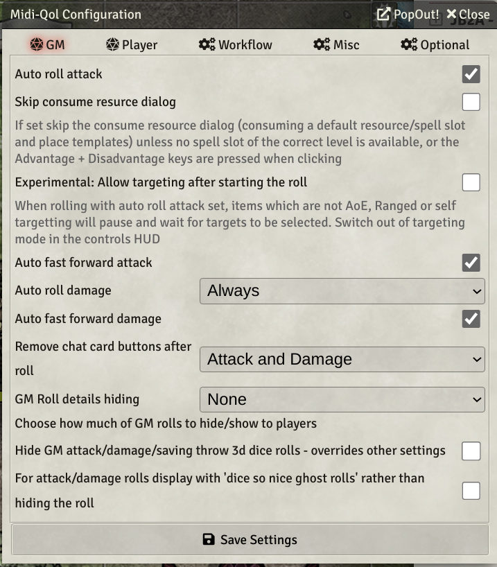
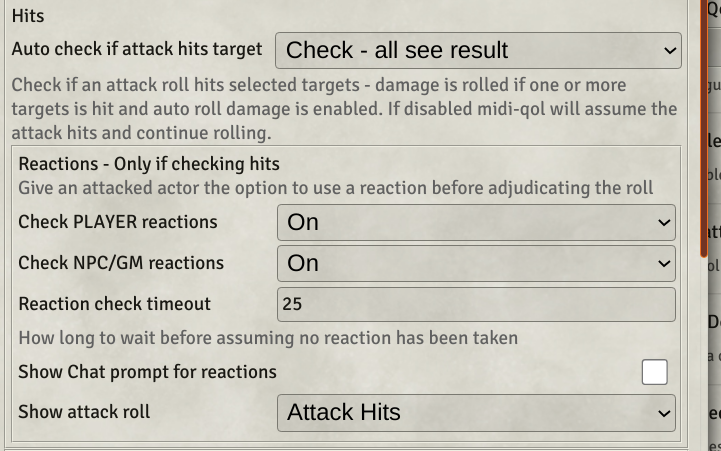
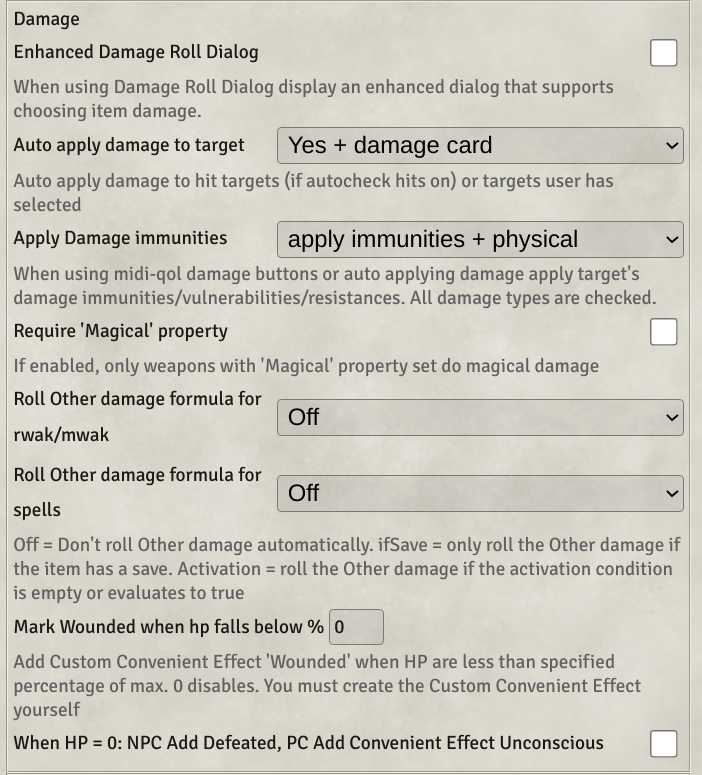
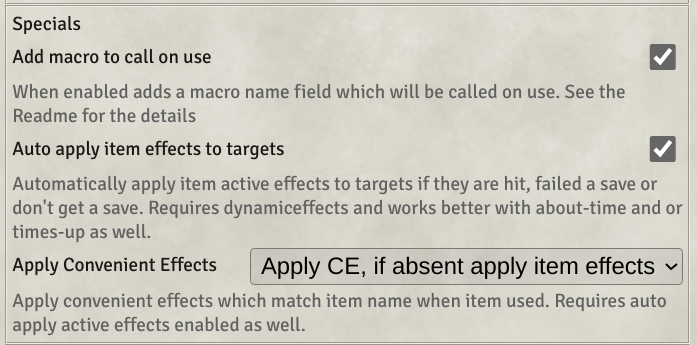
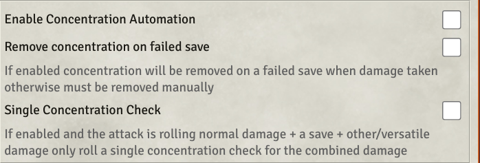

[TOC]

## What is this document?
This guide is intended for new users to midi-qol who need some guidance on setting the very many options that exist.
## What can midi-qol do?
Here is a spider attacking a goblin using the base dnd5e system.  

Here is the same spider biting the same goblin with midi-qol automation enabled and configured
| Spider Bite | Extra actions generated with same click |
| ------ | ------ |
|  | <ul><li>The attack and damage rolls have been made</li><li>A check has been made to see if the attack hit the target</li><li>The damage has been rolled, the bite damage and the poison damage</li><li>The goblin has rolled the consitution save</li><li>The save has been checked and the goblin failed</li><li>The damage has been calculated and applied to the goblin. (midi knows about damage resistance and takes that into account)</li><li>A GM only summary damage card has been displayed showing what damage was done and giving the option to revise it.</li></ul> |

## Prequisites
### Modules you must also install
#### libsocket
#### libwrapper
#### Dynamic Effects using Active Effects.
This is not striclty required but your life will be easier with it installed
#### Times-up
Required if you want effects to automatically be removed on expiry
#### Combat Utility Belt or Convenient Effects
## Configuration
### Conguration overview
First enable combat automation in the midi-qol settings.
The next sections cover configuring how that combat automation works, midi refers to a attack or spell cast as a workflow. You need to click on the workflow settings to manage the next set of settings.
#### Configure targeting

#### Configure attack and damage rolls
##### GM Tab

##### Player Tab

#### Configure checking hits

#### Configure checking saves

#### Configure applying damage

#### Configure active effects

#### Configure special keys

### Advanced(ish) features
#### Configure Concentration

#### Configure Reactions
* 
