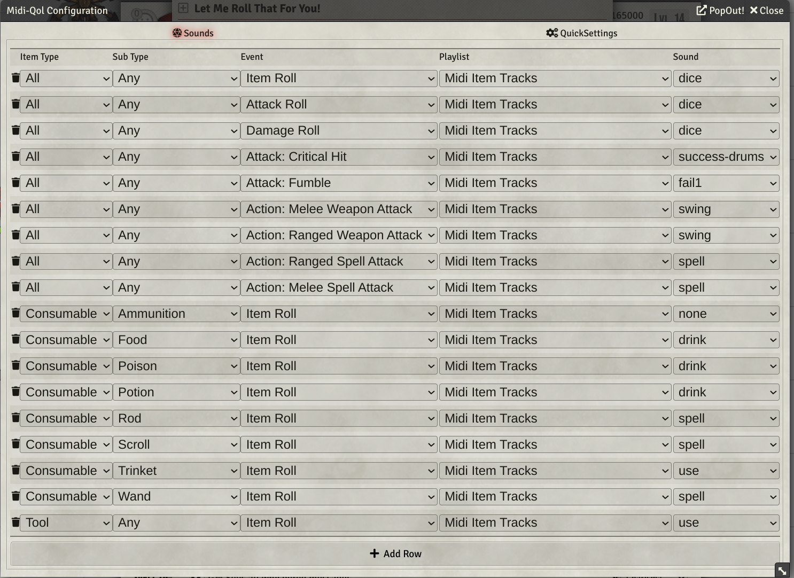
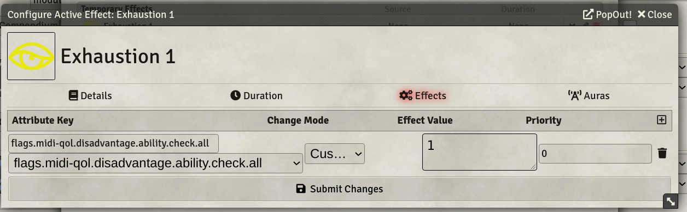
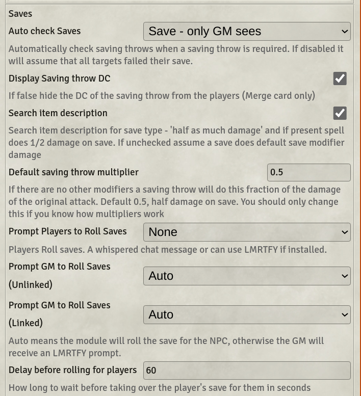
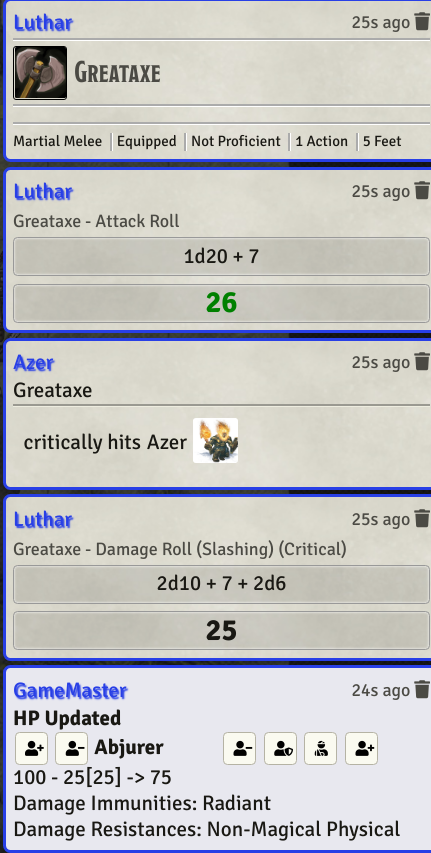
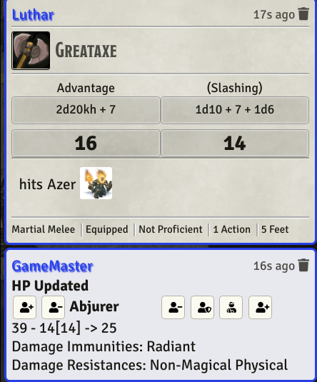

## Breaking News
Added a ko-fi donation link https://ko-fi.com/tposney

### Custom Sounds rewritten
You will have to change your configuration

Midi-qol is a module designed to help automate various parts of your game, specifically rolling attacks/casting spells and applying damage/effects.

It has LOTS of configuration options which can be daunting.

# Bug reports
**Important** When submitting a bug report ALWAYS include your exported (from the misc tab) midi-qol settings. I really can't work out what is going on without them.

The export settings exports all of your midi-qol settings, plus a list of the active modules you have installed. No world information is exported. The list of active modules can be very useful to me in debugging.

# midi-qol
Midi-qol is a replacement for minor-qol and you should not have both modules active at the same time.  (Both can be INSTALLED at the same time, but only one should be ACTIVATED.)  Because there are some subtle differences in the way the midi-qol works compared to minor-qol you will need to experiment with the settings.

## HELP! My midi-qol disappeared.
If you've just updated midi-qol and it disappears from your in-game list of modules you probably need to update your dnd5e system to the latest one.

## I just upgraded and nothing works anymore. 
I've seen a couple of cases where after migration of foundry versions the per player setting "enable workflow automation" gets set to off. This flag being unset causes midi to do nothing with rolls (hence the nothing works). **Also note that this is a per player setting, so each user needs to make sure it is on.**

## Midi works for some players and not for others....
Same problem as above - check workflow automation is enabled on all clients. You can use the module SocketSettings to force set the setting on all clients.

## Items I bring in from the sample compendium don't work. 
Some of the items require creating a DamageBonusMacro, make sure that is enabled in the midi settings. Also, if the damage bonus macro effect runs an ItemMacro.ItemName, the name of the feature needs to match the name of the item macro being run. For example Rage MQ0.8.9, will have to be renamed Rage when equipped on a character or the damage bonus macro won't run. I know this is not ideal, but I wanted to make clear when the version of the items changed.

## How do I write macros for this module?
Have a look at [Notes for Macro writers](#notes-for-macro-writers) which I try to update if new things occur. I've included some examples and if I do something I think is maybe useful, will add it to this section going forwards.

## I have a macro that works and just want to call it when using an item.
If you have a standalone macro, or one from (say) the community macros collection that you want to call when using an item, create an item and set it's onUse macro to the macro's name and set the pass to preamble complete. 

If you want to get fancier then change the point at which it is called and have a look at the data passed to onUse macros. Or use a `macro.execute` (some changes may be required) which is only called if active effects are applied to the target.

## MidiQOL sample items compendium
midi-qol is an automation tool that is meant to make it possible to automate some/many facets of your game. It is not a library of items that you can plug and play into your game and many great macro modules that play well with midi-qol (too many for me to list and I'm sure I don't know them all).

Similarly there are some excellent tools for animation effects, beyond those supported directly by dae/midi. I don't know them all and I have no doubt that there are some gems that I simply have not discovered, but do use Automated Animations in my game as well as Token Magic FX.

midi-qol combined with DAE has lots of ways for you to implement items/spells/features you might want. Sometimes that will require writing macros, and sometimes not.

Over time I have come up with some items that I use in my game, which I think others might find useful, or which might have some interesting ideas for other to develop their own items. I have created a sample items compendium of these which you are free to use in any way you want. The warning is that whilst they work in my game, they may not in yours and there is no certification that they are fit for purpose. Feel free to try them and if they work for you great, if not make them better and share with the community - I am always happy to receive suggestions for inclusion. I try to add a version number to items to indicate the midi-qol version in which they were updated. You don't have to keep the version number in your game.

[TOC]

# Changes in dnd5e 1.5:

## Enhanced dnd5e critical damage effects. 
You can make most of the changes that midi-qol supports for critical hits via the new game settings (max base dice, double modifiers as well as dice) and per weapon settings (additional dice). If you want to use the dnd5e critical damage fields set the midi-qol critical damage to "dnd5e default"

You will need to experiment to confirm the interaction of the dnd5e critical damage flags and the midi-qol settings, however if you use the dnd5e default setting in midi-qol the rolls will not be modified by midi in any way and the dnd5e system will operate.

Midi-qol supports exploding dice for critical hit dice if enabled.

# Changelog
https://gitlab.com/tposney/midi-qol/-/blob/master/Changelog.md

# Symbiotic Modules
I don't spend a lot of time examining all of the modules that are written (and there are hundreds) so it is almost certain that other modules can substitute for the Highly Recommended/Good to Have just as well. If your favorite module is not in the list, it probably means I just don't know about it, so don't take the absence of a module from this list as a negative - it simply reflects my ignorance.

## Required Modules
You have to have these, period.
* libwrapper
* socketlib

## Almost Required
You can probably survive without these but midi pretty much assumes they are installed.
* **Advanced Macros** **No longer required/used**
* **DAE**
* **Times-up** - for automated expiry of effects. If you don't use combat expiry then you can use about-time instead.
* **Simple Calendar** - to manage the game clock
* **Item Macros** - many of the sample items I include have itemMacros on them, without the module you can't examine the macro.

## Highly Recommended
* Either **LMRTFY** or **Monks Token Bar** (or both) to manage saving throws
* Either **Convenient Effects** or **Combat Utility Belt** (or both)
* **DAE SRD**/**Midi SRD** (lots of prebuilt items) **These modules do not work with V10 so only use them for ideas, not working items**.
* **Active Auras** - works well with midi/dae and some of the sample items require it.
* **Token Magic** - lets you add some spiffy graphical effects to spells.
* **SmallTime** - to make time advancement easy.
* **Automated Animations** - If you have the **jb2a** module this will automatically add lots of animations to spell/weapon effects.
* **libChangeLogs** - will show the midi change log when it changes.
* **DF QoL** - If you want template targeting to work as written in the rules, install this and enable it for template targeting. (apologies to @flamewave000 for the mislabelling)
* **Warp Gate** - Some of the sample items use warp gate to summon tokens (Flaming Sphere, Spiritual Weapon).
* **Build-A-Bonus** This moudle allows more complex bonuses to be calculated than dae/midi support by default. The bonus can be attached to an actor/item/active effect. 
* **Template Macros** Allows you to run a macro when a template is placed, very useful.
* **Effect Macros** provides another way to trigger behaviour when an effect is applied, combat updates and so on. Allows for more complex over time type effects via macros. The down side is that it does not include all of the midi data that onUseMacros get, but you can use flags.midi-qol...., flags.dae to set some of the values you might need

## Good To Have
* **Active Token Lighting.** Allows tokens to emit light
* **Levels.** if you are doing anything with height.
* **Levels - Volumetric Templates**
* **DnD5e Helpers.** if you want some help with a lot of misc 5e stuff
* **Dice So Nice.** if you like 3d dice rolling it's pretty much the only choice.
* **Better Rolls.** if you don't like the default dnd attack/damage roll cards. Better Rolls is **mostly** compatible with midi-qol, but there are some wrinkles. I don't use the module so tend to rely on community reports for errors.
* **FVTTEncounterStats.** If you like to keep data about all the rolls done by players/GM this module goes a lot further than the built in midi-qol roll stats. Worth a look.
* **Simbul's Cover Calculator** or **Levels Auto Cover** enables the automatic calculation of cover bonues for 1/2, 3/4 cover.

# (In)Compatibilities? ##
As already mentioned I don't look at lots of modules, so there will be others that do/don't work with midi. As they come to my attention I'll try and update the list.

## Dice So Nice
Midi generally works with dice so nice, but the interactions are more complicated with the merge card.

## Let Me Roll That For You
Midi-qol can use Let Me Roll That For You for player/gm saving throws and is the preferred roller. There is a "feature" that LMRTFY returns the roll result to midi before the 3d dice have finished rolling, so you may see the saves display before the dice finish doing their thing.

## Monks Token Bar
Midi-qol can use Monk's Token Bar to roll saves. **Update** adv/dis advantage for magic resistance/concentration now work with MTB.

## Dfreds Quality of Life  
Midi supports the foundry template targeting, DF Qol has support for rules as written template targeting behaviour. There is an option in midi's AoE auto target to use DF QoL's template targeting, which disables midi's internal template targeting. You should only enable one sort of template targeting since mid/df-qol will fight over who gets to do the targeting which will lead to confusing results.

As of version 1.6.0, DF QoL does not seem to have a wall blocking option, so if that is important you'll need to use midi's targeting or another module that supports both.

## Convenient Effects
Midi supports the application of Convenient Effects spell/item effects (configuration setting - Apply Convenient Effects) and matches those by name. For example, if you cast the spell Bless midi will see if there is a convenient effect "Bless" and apply it to any targets that were hit by the spell.

If you have apply convenient effects set and use items from the with DAE effects, **you will get a double up of the effect**. You need to choose how you want the item to behave, if using convenient effects, delete the DAE effects. The double up problem is intentional, since you might wish to augment the Convenient Effect definition with your own extra effects on the item. 

If you generally use hand crafted effects I suggest setting apply convenient effects to false and then enabling convenient effects on an item by item basis (using the setting below).
If you generally use convenient effects you would disable the convenient effect for the items that you want to use from DAE hand crafted effects.

There is an additional check box available on the item sheet, for items that have corresponding convenient effects. The check box reverses the "apply convenient effects setting" for that item. If you have "auto apply convenient effect" set to true, the check box will disable the auto application for that one item. Similarly, if you have "auto apply convenient effect" set to false, the check box will enable the auto application for that one item. 

## levels
- Midi-qol will use the levels wall collision detection for its distance calculations/LOS calculations.

## levelVolumeticTemplates
- Midi-qol will use levels volumetric template target calculations if installed.

## Furnace (deprecated for Foundry 0.8.x - Use Advanced Macros)
If you intend to make use of any of the macro features in midi-qol you will need to install the Advanced Macros module. As of 0.9.56 there is no dependency on advanced macros/furnace.

## Better Rolls
If you are using Better Rolls (which is a great module), midi-qol takes over once the hit/damage card is placed by Better Rolls. This means that resource consumption, template placement, critical/fumble determination are **all** handled by Better Rolls before midi-qol kicks in. Midi-qol checks hits, saves, applies damage, and calls active effects. When using Better rolls flags.midi-qol should be applied. As of foundry v10/dnd5e 2.0.0 better rolls is no longer supported. At some point I will look at supporting Ready, Set, Roll (the better rolls successor).

## Magic Items
**(Thanks to @simone for his help)**
Midi-qol is mostly compatible with magic-items. The only issue is that spell templates for spells in a magic item are not auto-placed on casting. Once placed everything works as expected. Spells/features that can be rolled will work.  
Items that create changes by being present in the characters inventory (i.e. passive/transfer effects) won't behave as expected since they are actually held in the characters inventory, this includes transfer active effects.  

## Mess
 Midi-qol and Mess dnd5e effects are not compatible. Template effects and the other features of that excellent module should work. If you want Mess attack/damage cards don't use midi-qol.  

## Cozy player
Minor-qol was not compatible with cozy-player, with targets being lost before attack/damage rolls were made. I have done only limited testing but it seems that there are no problems with cozy-player and midi-qol.  

## Cautious GM
Midi-qol breaks the blind chats by hidden GM feature of cautious GM.  

## Chat Portraits
 If using Chat Portraits, the changes made by midi-qol to the token/actor name in chat cards are overwritten/lost. Choose which sort of highlighting you want - only one will work. Otherwise, all seems to work.

## Ez-Roller
The 'send to chat log' feature of ez-roller will disable combo cards in midi-qol.  

## Combat Utility Belt
CUB concentrator and midi-qol concentration automation are incompatible. Choose one or the other. If you want concentration to expire at the end of the spell you need to install times-up and use midi-qol concentration automation.

## Maestro
Maestro looks for the attack roll chat card in the chat log to play its critical/attack/fumble sounds. If you are using the merge card then the attack roll card is never created and Maestro can't play its sounds. You can use the midi-qol custom sounds instead.

## Item Macro
 You can create itemMacro macros with this module and call them from midi's onUse/DamageBonus macro fields by adding ItemMacro (case-sensitive) in the macro field.

If you have installed itemmacro please make sure you disable the ItemMacro config settings:

  * "character sheet hook" else when you use the item the macro will get called bypassing midi-qol/dae completely and none of the arguments will get populated.

  * "override default macro execution"  If this is enabled the hotbar hooks will directly call the item macro and won't work as expected for dae/midi.  
The settings are per player so each player needs to change the setting to disabled.  

## Dnd5e-helpers
Midi-qol has configuration options (in the optional rules section) to incorporate the AC bonus calculated by dnd5e-helpers. There are two settings dnd5e-helpers which allows an attack if any of the 4 corners of the target are visible and dnd5e-helpers+AC which will include the AC bonus from armor when calculating a hit. The bonus AC on the target will be displayed in the to hit card.

## Warpgate
Some items in the midi sample items compendium use warpgate and won't function otherwise. It is also a very useful module for handling creating tokens on the canvas

## DDB Game Log.
DDG Game Log sends rolls from dnd beyond to foundry. If DDB Game Log is enabled in the optional settings section of midi, making an attack roll (or damage roll if there is no attack roll) will trigger a midi-qol workflow for the attack. Hits will be checked, saving throws asked for and damage applied as per the rest of the midi-qol settings, except that midi will wait for dnd beyond and will resolve when the dnd beyond roll is made.

You can run mixed games with some/all players/monsters on dnd beyond and some on foundry only. It's really up to you. 

Things to keep in mind:
* If you want saving throws to be made on dnd beyond then make sure to se the midi saving throw setting to Chat Message. DND Beyond integration will work with LMRTFY/Monks Token **but** the roll will be prompted for and rolled in foundry **not** DND Beyond.
* When casting an AoE spell midi will target in foundry, auto starting the place template action (as if you had cast the spell in foundry).
* Damage/effects are applied in foundry only, no updates of any sort are passed back to DND Beyond.
* DnD Beyond does not apply any foundry in game effects made to actors, so attack, damage and saving throws will not use any foundry local data, like short term damage bonuses.
* Midi will look only at the foundry data, so it is up to you to keep things synchronised between the two.
* Effects that increase attack bonus/damage dealt (when applied in foundry) will have no effect on attack/damage rolls made on DND Beyond. Midi **will** take into account effects that change AC (when checking hits), damage resistance, etc. when applying damage.

## FVTTEncounterStats. 
This module keeps very detailed stats about each encounter you run and is fully compatible with midi-qol. If keeping game stats is your thing it's worth a look. Much better and more informative than the midi inbuilt rollStats.

## Minor Roll Enhancements.
* Generally not compatible.
* You can use MRE to manage accelerator keys, provided you set it to be registered first in libWrapper settings.
* I've only done a little bit of playing with the attack/damage behaviour, but it seems to be incompatible with midi.

## Advantage Reminder for dnd5e
If you don't fast-forward rolls this does a good job of highlight the default advantage/disadvantage/critical status of a roll.  
Reminders also lets you highlight when a saving throw might meet advantage which midi can't process (e.g. advantage on poison saves).  
Thanks to @kaelad for highlighting a midi problem, as of 0.9.11 midi is compatible with Advantage Reminder for attack and damage rolls.

## GM Paranoia
Midi-qol is not compatible with GM paranoia.

# Short Guide to configuration settings
The heading says short, but it really isn't.


## Workflow settings
* **Speed Item Rolls** 
Poorly named, but historical, speed item rolls let you configure how the ctl/alt/shift keys work.

If speed rolls are off, all of the ctrl/alt|meta/shift keys and roll behaviour are the same as in core. There is one additional feature: if you click on a damage button in chat, CTRL+ALT click will use the critical/normal hit status from the midi-qol roll data.

If speed rolls are enabled you need to assign the keys yourself.
If you enable speed ability rolls as well, your key mappings will apply to ability check, save and skill rolls as well.

* advantage key modifier, defaults to Alt/Meta
* disadvantage key modifier, defaults to Ctrl
* versatile key modifier, defaults to Shift.
* critical damage modifier, defaults to Alt/Meta.
* fast-forward key (turn any attack or damage roll into a fast-forwarded or disable auto fast-forward if set) advantage+disadvantage.

If you have speed item rolls enabled **Caps-Lock** behaves as if advantage & disadvantage are both pressed, which will invert the fast-forward automation setting for rolls. 

If you assign a key multiple meanings the behaviour is going to be confusing at best.

## Display
* **Card styles** Midi-qol supports two options for item/attack/damage/save rolls. The Merge card combines all of those rolls into a single card. If Merge card is disabled you will get a separate chat card for each roll, which is the default dnd5e look and feel. The condensed Merge card simply puts attack and damage next to each other to conserve a bit less space. The merge card is recommended.
* **Show Item details in chat card**. You can configure whether the item details are included in the chat card. If disabled, the item description is not added to the card, you can configure which items have the info displayed. If enabled, you can use the dnd5e setting to choose if it is expanded or hidden when displayed. 
* **Chat cards use token names**. If the field is blank actual actor/token names will be used in the chat card, hits/saves display for non-GMs. If set to a string the actual names will be replaced in the chat cards with the string. This feature is not a replacement for Combat Utility Belts hide names feature, rather it addresses those fields that CUB does not know about. For full hiding of names on cards and the tracker you need to use CUB in conjunction with midi-qol.
* **Chat cards use token name** By default chat cards are sent with the name of the actor (i.e. "Orc"). If enabled, the name of the token will be used instead (i.e. "Orc with a terrible limp").
* **Hide Roll Details** There are several settings, hide roll formula, hide all details, d20Attack + hide roll formula, show d20 attack roll only amongst others. Some only work with the merge card.

## Targeting
Almost everywhere midi-qol uses the **targeted** tokens to apply hits/saves/damage not **selected** tokens. Targeted tokens have 4 arrows pointing at the token and selected tokens have a box around them.

* **Auto target on template draw** If a spell/feature has an area effect template then enabling this setting will auto target (for later damage application) all tokens inside the template once placed. Also, the roll will not progress (i.e. roll saves or apply damage) until the template is placed. If **"walls-block"** is selected then any wall between the template origin and the token will block the targeting. There is an additional setting **"Use DF QoL"** which requires the DF-QOL module to be installed and active
* **Auto target for ranged spells/attacks** If the item specifies a ranged target with a target type of creature/enemy/ally then all tokens within range of the caster will be auto targeted when the effect is cast. “enemy/ally” are enemies/allies of the caster. 
* **Auto roll attack**, **Auto roll damage** and **Auto fast-forward rolls**. The auto roll attack and damage settings tell midi-qol to start an attack roll or damage roll if there is one. The auto fast-forward settings determine if the advantage/disadvantage and/or critical/normal dialogs are shown or suppressed. Damage can be set to “Attack Hits”, which will roll damage only if the attack roll was sufficient to hit the target. These are settable on the GM/Player tabs.
* **Require targets to be selected before rolling** It is incredibly common in my games that players forget to target before starting the roll. This setting will not allow them to roll if they have not selected a target and one is needed. (Auto-target spells - like a fireball - are not affected by this setting.)

## Saving Throws
* **Auto Check Saves** Set this to “None” if you wish the players or GM to be responsible for rolling and evaluating saving throws.  (If you want only one group to roll manually and the other to roll automatically, set this to “None” and make appropriate choices for the “Prompt Players to Roll Saves” and “Prompt GM to Roll Saves” settings).  Otherwise, set this to control the visibility of saving throws that will be automatically rolled and evaluated for each targeted token.
  * Save - all see results. Saves are rolled and who saved/failed to save is visible to all users.
  * Save - only GM sees. Saves are rolled and the save/fail display is only visible to the GM.
  * Save - All see results + Rolls. Normally the NPC rolls are hidden; this option shows the roll chat cards to all players.
* **Prompt Players to Roll Saves** If "None" set the module will automatically roll all saves.  If set to another value, the system will prompt the player to roll their save and wait up to **Delay before rolling** seconds before auto rolling the save for them. You can also specify Monks Token Bar for saves. Monk's token bar rolls do not support setting of advantage by midi-qol.
  * Chat Message. If selected, an impacted player will receive a whisper in chat prompting them to roll a saving throw.  The module will assume that the next saving throw in the chat stream from this player was the requested roll and evaluate it.  
  * Let Me Roll That For You.  If selected (and LMRTFY is installed and enabled), midi-qol while use LMRTFY to prompt the player who controls the target (or, if there is none, a randomly chosen player with ownership rights to the target) to make the roll.  The specific roll details are passed to LMRTFY and multiple rolled (i.e. more than one spell requiring a save) will be correctly allocated.
  * Monks Token Bar. If selected (and Monks Tokenbar is installed and active) characters with a logged in player owner will be added to a monks token bar saving throw dialog. Completing the roll from the dialog will be used as the save. Monk's token bar rolls do not support setting of advantage by midi-qol.
* **Prompt GM to Roll Saves** Set this to “Auto” to have midi-qol automatically roll and evaluate NPC saving throws on behalf of the GM.  Set to “Let Me Roll That For You” to instead have the LMRTFY module prompt the GM for NPC saving throws. You can also use Monks Token Bar saving throws.
* **Display Saving throw DC**. Determines if the saving throw DC is displayed to the players and on the chat cards. If unchecked, saving throws will display on the chat card with the value replaced by “??”. 

**Saving Throw Multiplier**
You can ignore this section until you find spells/weapons that don't do what you'd expect.
TL;DR: If you are just using standard items you can just leave things at the default and most saves will do 1/2 damage as you'd expect, monsters (like a giant spider) will (if Roll Other Damage is enabled) do base weapon damage and have a save applied to the bonus poison damage.
  * There is a config setting, default save multiplier (defaults to 0.5). If there are no special overrides then a saving throw will do 
    `rolled damage * defaultSaveMultiplier` damage. When set to 0.5 saving against the attack will do 1/2 damage, like most cases for dnd.
  * There are a number of ways to override the default multiplier.
  * If the item description includes the text "no damage on save" (or the localized equivalent) then a save will do no damage.
  * If the item description includes the text "full damage on save" (or the localized equivalent) then a save will still do full damage. You can use this for attacks that do damage, and have a save for a condition being applied, like poisoned and so on.
 *  `flags.midi-qol.potentCantrip`, if set cantrips cast by the actor will do 1/2 damage instead of no damage. Overrides any other damage multiplier settings.
  * If the setting "search spell description" is set, items with the text "half as much damage" (or the localized equivalent) will do 1/2 damage on a save ignoring the default multiplier. If the text is not found the save will use the defaultSaveMultiplier.
  * For weapons (only) there are weapon properties for 1/2, full or no damage saves. These properties override any other settings. If not present the save multiplier will be worked out as above. 
  * For weapons (only) the save multiplier applies to the whole damage roll **UNLESS**...
    * You have enabled "Roll other damage on mwak/rwak" (which is intended specifically to support attacks that have base damage + extra damage with a save - think spider bite). If the weapon has a save specified **AND** the weapon has an Other Damage formula, the saving throw multiplier applies to the Other damage and the base damage is applied as full damage.
    * Because of the way the SRD monsters have been set up, (i.e. extra damage as versatile damage and the versatile property not set) the versatile formula will be treated as Other Damage if there is no Other Damage formula and the weapon property "versatile" is not set. 
    * For BetterRolls you have to enter the damage into the Other field and enable roll Other in the better rolls settings. Midi will pick up this damage and apply the saving throw result against it.

For those who have a lot of weapons set up with a save and want the default damage on save to be full damage (which is what a previous version enabled when search spell description was enabled) just edit the items and set the save to full damage on save (preferred) or set the default save multiplier to 1.

## Hits
You can enable auto checking of hits. Fumbles automatically miss and criticals automatically hit. As GM you can mouse over the name of the hit target to highlight the token and click to select it. This is useful if you are not auto applying damage, since you can do all the damage application from the chat log, by clicking on the targets name, then clicking on the appropriate damage button.

## Damage
* **Auto apply damage to target**
  * Yes: Damage is auto-applied to targeted tokens (**or self if self-target is specified**) that were hit or did not save, or that saved and take half damage.
  * "+ damage card": If included, a chat card is sent to the GM which includes each target that had damage applied with details of the damage, any immunities/resistances and some buttons. The first button sets the target hit points based on the calculation displayed. The dropdown controls how the damage is applied, "Calc" means take into account damage immunity/resistance etc. multipliers change the amount of damage applied but **do not** take into account resistance/immunity.


* **Apply Damage immunities** Midi-qol will use the target’s resistance/immunity/vulnerability settings for each type of damage in the attack and calculate how much of the damage applies. If "+physical" is set midi-qol will look at the item that did the attack to see if the damage is magical or not according to the following:
  * If the item is:
    * not a weapon: the damage is assumed to be magical
    * a weapon has an attack bonus > 0: it is assumed to be magical
    * a weapon has the "Magical" property set: attacks are considered magical. (The magical property for weapons only exists if midi-qol is enabled)

You can configure how much resistance reduces damage or how much vulnerability increases damage. Defaults to the dnd setting of 0.5 and 2. These figures multiply the damage done of the appropriate type by the multiplier
* **Auto apply item effects to target** If the item had dynamic effects which are currently active as specified and the target was hit and did not save; OR did not save; OR there are no attacks or saves: dynamic effects is called to apply the active effects to each such target. This includes self if a self target is specified.

### **Roll Other formula for rwak/mwak** **Roll Other formula for spells**

Roll Other Damage has 3 options,
- **"off"**: never auto roll the other damage,
- **"ifsave"**: roll the other damage if a save is present (this is the same as the earlier version of this setting)
- **"activation"**: if the item's activation condition evaluates to true then roll the Other damage even if no save is present. "activation" also requires that the item attunement not be "Attunement Required", i.e. dragon slayer weapons do no extra damage if they are not attuned.

Most creature attacks with extra damage (poisonous bite) equate to the ifSave setting.
Magic items that roll additional damage if a particular condition is true (slayer weapons) require the "activation" setting.

midi will evaluate the activation condition as an expression, providing, the actor, item and target actor's (@target) roll data. For example:
```
    target.details.type.value.includes("dragon")
```
will only roll if the target has a type of dragon. 

The evaluation of conditions has changed, You do not need to put @ in front of fields, but still can. If the field is a a string then @ fields must be enclosed in quotes, i.e. "@target.details.type.value".includes("dragon").


Specifically midi will populate the expression data with:
* casting actor, anything from actor.system (direct via @field, e.g. @attributes...),
* casting actor, anything from actor.flags (via @flags....),
* anything from item.data.data (via @item.damage.),
* anything from the target.actor.system, via (@target.abilities etc),
* anything from the workflow itself (via @workflow.attackRoll etc).

**An empty activation condition** will evaluate as true. If you don't want a specific weapon to roll Other Damage set Activation Condition false.

You can add the above condition to the SRD slayer items to make the bonus damage automated based on target type.

If the weapon rolling the attack has ammunition AND the weapon does not have its own Other Roll defined, the Other activation condition, Other roll and saving throw from the ammunition will be used instead of the attacking weapon. (Arrow of Slaying).

There is a new weapon property "Crit Other Roll" which when set means that the "Other Damage" roll will be rolled as critical if the base roll is critical. Previously Other Damage would never roll critical damage. You can decide if your Arrow of Slaying can do critical damage or not.

**Mark Wounded When damage falls below %**. (Requires Convenient Effects)
You can specify a percentage (0 disables) so that when the HP of a token falls below X% the Custom Convenient Effect wounded will be applied to the target. This is useful if you are not showing the HP status bar to players so they get some idea if a baddie is hurt or not. You must create the Wounded condition (Wounded is a localisable string so it may vary for you game).

If you are not using convenient effects you can set this up much more flexibly in Combat Utility Belt using Triggler.

**Add defeated when HP === 0**. The dnd5e defeated condition will automatically be added to the token if it's hp fall to 0.

## Custom Sounds Complete rewrite as of v0.9.29
Existing custom sounds will be disabled.
  
  Custom sounds apply to both merge and non-merge cards.
  Custom sounds Will play even with dice so nice active.
  The General Format is to specify a sound for
    - Item Class (any/weapon/spell/etc)
    - Item Subtype (all, Martial Melee, Evocation etc)
    - Action, roll the item, attack, mwak, roll damage, damage of specific types
    - Playlist to get the sound from
    - Name of the sound to use, drawn from the specified playlist 
    - You can now use as many playlists as you wish. 
    - Support for special sound names, "none" (no sound) and "random", pick a sound randomly from the playlist.
    
  * In the case that more than one setting might apply midi always chooses the more specific first. So:
      - Weapon/Martial Melee/mwak will be used in preference to 
      - Weapon/all/mwak, which will be used in preference to  
      - Any/all/mwak

  **Actions**
    * Item Roll is checked when the item is first rolled to chat.
    * attack/rwak/mwak/msak/rsak/hit/miss/critical/fumble etc. are checked after the attack roll is complete and hits have been checked
    * Damage/damage:type are checked after the damage roll is complete.

  * Can be configured from the Configure Midi Sounds panel immediately below the midi workflow panel on module config settings.
  * You can create very complex setups, but don't need to.
  * To get your toes wet, enable custom sounds on the workflow panel (where it has always been).
  * Open the Configure Midi Sounds panel.
    - From the quick settings tab, choose create sample playlist, which will create a playlist with a few sounds already configured
    - Also on the quick settings tab choose Basic Settings, which will set up a simple configuration of custom sounds. This is roughly equivalent to what can be configured with the existing midi-qol custom sounds, but has a few more options and can be extended.
    


## Other QOL settings
* **Add attack damage buttons to the inventory** If enabled then a set of buttons (to bypass the midi-qol behaviour) are added to the description drop-down in the inventory.
* **Fast-forward ability rolls** If enabled, allows you to bypass the advantage/disadvantage question when rolling ability saves/checks; ctrl/alt are supported.
* **Critical Damage Type** adds options for how critical damage is treated. Only in core 0.7+.
* **Add Damage Buttons to Chat** If enabled then any dnd5e standard damage roll (not mess/BR etc.) will have damage buttons added that appear on hovering over the card, provided a token is selected and allow applying damage to the **SELECTED** token, the damage immunities setting is used. This is the only place where midi-qol uses the selected token rather than targeted.
* **Item Delete Check** Displays a confirmation dialog if an item is deleted from the inventory.
* **Colored Border** Use the player color to put a colored border and/or color the actor/token name on chat messages.
* **DM sees all whispered messages** Copy the GM on all whispered messages.
* **Untarget at end of turn** At the end of a players turn(i.e. combat tracker is advanced) all/dead targeted tokens are untargeted. There is a GM option since I regularly forget to untarget after an attack and break things on the next turn. If midi-qol is managing the roll then dead tokens are untargeted after an attack, so that players can avoid "flogging a dead horse" as it were.
* **Players control invisible tokens** 0.7.1+. If enabled then players can both see and control tokens they own that are hidden.  Also, any token they own will **always** appear on their map. **Deprecated** Please use the excellent Your Tokens Visible instead.
* **Force Hide Rolls** If enabled then private/blind/gm only rolls will only appear on the recipient’s chat log. This must be enabled if you are using Better Rolls and combo cards.  

## Optional Rules
Midi supports various optional rule settings that can be useful.
* **Incapacitated Actors can't make attacks.**
If a token has 0 HP, they cannot attack
* **Invisible/Hidden Token attack with advantage**
If a token is invisible/hidden (CUB/Conditional Visibility) it attacks with advantage.
* **Attack removes hidden/invisible**
Remove invisible/hidden when making an attack
* **Check Weapon range when attacking**
Check the range of the weapon when doing an attack. Impose disadvantage for range > short range. Fail if range is > max range.
* **Include Height in range calculation**
Take token height differences into account when checking range.
* **Ranged attacks when Foes are closer than X have disadvantage**
If you make a ranged attack when a foe is less than X feet/meters from you the attack is made at disadvantage.
* **House rule for Damage Reduction**
Choose how to combine Damage Reduction
* **Critical/Fumble for saving throws**
Critical saves always succeed, fumbled saves always fail.
* **(House Rule) Ranged attacks at foes with nearby allies have disadvantage**
If making a ranged attack at a target whose size is less than that specified and there is an ally within 5 feet of the target the ranged attack is made with disadvantage. (You want to avoid hitting your friends but really big targets can still be hit safely).
* **Active Defence**
Expirmental: Support for the Active Defence variant rule. Enable via optional rules setting Active Defence. 

Requires LMRTFY and does **not** work with better rolls. 
  * Active defence has attacked players roll a defence roll instead of the GM rolling an attack roll, which is meant to keep player engagement up. https://media.wizards.com/2015/downloads/dnd/UA5_VariantRules.pdf
  - If active defence is enabled then when the GM attacks instead of rolling an attack roll for the attacker, the defender is prompted to make a defence roll. The DC of the roll is 11 + the attackers bonus and the roll formula is 1d20 + AC - 10, which means the outcome is identical to an attack roll but instead the defender rolls.
  - As released this had identical behaviour to the standard rolls with the exception that each player effectively has a individual attack roll made against them.
  - Advantage/disadvantage are correctly processed with attacker advantage meaning defender disadvantage.
  - A fumbled defence roll is a critical hit and a critical defence roll is a fumbled attack, midi checks the attacking weapon for the correct critical hit/fumble rolls.
  - Timeout for player interaction is taken form the saving throw player timeout.
  - Display of the defence roll DC on the defenders prompt is taken from the saving throws display DC setting.
  - Issues: There is only one critical result supported, so if multiple targets are attacked they will all have critical damage rolled against them or none. (future might support individual results)
  - There is only 1 advantage/disadvantage setting applied, that of the first defender (same as current midi-qol). Future enhancement will use per character advantage/disadvantage settings.
  - Only works for mwak/rwak/rsak/msak.
* **Challenge Mode Armor Class.**
  * Implements the Challenge Mode AC rules, characters have an Evasion Class (EC) and an Armor Resistance (AR). In the base mode your EC is 10 + the dex mod applied to your AC (based on armor type used) + any shield AC you have.  
  If an attack roll:
    * is < your EC the attack misses.
    * is >= your EC and <= your AC, it is a hit, but it did not penetrate your armor, so the damage you take is reduced by your armor resistance. 
    * > your AC the attack hits normally.  
  Your AR is equal to your AC - applied dex mod, i.e. the part of your AC that is not nimbleness
  This means that tanks, high armor class but weighed down take more glancing damage, but that damage is mitigated by your AR. The logic of the system is that part of hitting is having the blow land  on the target, which is measured by the EC which rewards nimble characters and secondly damage reduction done when a glancing blow does not get "through the armor" and so the damage is reduced by the Armor Resistance.
  * Some informal testing suggests this is badly weighted against tank classes once they reach a high enough level to be fighting tough opponents doing high levels of damage, since many of the EC hits will get through the AR but there is no compensation for taking this extra damage.
  * The **house rule** version makes the following changes.
    1. The damage from an EC hit (i.e. greater than EC and <= AC) is scaled, so a tank with 8 points of armor reduction wil take 1/9. 2/9, ... 9/9 of the rolled damage when an EC hits for EC, EC +1, EC +2 ... EC+8
    2. The damage reduction applies for all hits except critical hits.

### Settings for full auto mode:
If the above was discussion was all too tedious here are the settings I use.
* Speed Item Rolls on - if you want to be able to shift/ctrl/alt click.
* Merge to One card checked,
* Condense attack/damage cards checked.
* Auto Target on template Draw - walls block
* auto range target. Leave off until you are comfortable with the way everything else works.
* Auto FastForward - attack and damage. If you want to be prompted as to advantage/disadvantage/critical/normal adjust appropriately. Even if enabled midi-qol will use the result of an attack (critical/normal) to do the roll.
* Auto Check Hits - Check your choice as to whether the players see the results - I use on.
* Auto roll damage - Attack Hits
* Saves - Save, your choice of whether the players see the results - I use players see results.
* Check text save - depends on you. If enabled the text of the spell  description is searched to see if the damage on save is half/no damage.
* Players Roll saves - Let Me Roll That For you
* Player save timeout - I give my players 20 seconds but you can choose what works for you.
* Auto apply damage - yes + undo damage card
* damage immunities - apply immunities + physical. (if a weapon attack has a plus in the item detail or the damage came from a spell or the Magical property is checked) the damage is considered magical.
* auto apply item effects to targets checked. This will apply any dynamic effects to targets when:
1. The item has a save and the save fails.
2. The item has an attack and the attack hits.
3. There is no attack or save.


### midi-qol Alternate QuickStart Settings
**contributed by dstein766 (aka OokOok on Foundry discord)**
Another collection of settings, designed to achieve these goals:
* Players always roll their own attacks, damage, saves, etc.  (The computer still rolls the dice, but the player is always in charge of initiating the rolls.  The computer never rolls dice without the player’s interaction.)
* Support automatic application of relevant dynamic active effects for the widest possible set of PCs and NPCs.
* Support automatic application of advantage and disadvantage without player selection.
* Do NOT display hit/miss results to players – let them wait for the DM to tell them the result.
* Do NOT display the success/failure of saving throws automatically – let the DM tell the players when it is appropriate.
* Do NOT generate damage results until a hit is confirmed.  
* Do NOT display saving throw DCs to players.
* Targeting is optional.  (This increases the workload on the GM…but experience around my table is that players don’t like the extra step, so I made it optional.)
* Place useful information into chat regarding spells cast or items used, but do NOT print fluff for weapons.  (Weapon attacks happen often enough that anything beyond dice roll results causes too much “bloat” in the chat window.)
* Support (optional) rolling of physical dice by players while retaining as many of the prior goals as possible.  To support physical dice rolling I use the module DF Manual Rolls.  The player rolls his physical dice and inputs his UNMODIFIED results into a dialog.  Those results are then passed to midi-qol, which applies all appropriate modifiers and proceeds as if the computer had rolled the supplied results.  End result is that players can roll physical dice OR let the computer roll the dice, but ultimately everyone benefits from the midi-qol workflow.
#### Basic module settings:  CHECK (enable) the following OR select from the drop-down: 
* Enable roll automation support
* Add attack/damage buttons to item inventory list
* Add damage buttons to chat message
* GM sees all whispered messages
* Really hide private/blind/self rolls
* Fast-forward ability rolls
* Choose how to roll critical damage: as per your house rules
* Experimental: Apply checks before doing speed/macro roll
* Colored Border Messages: your choice (I use Borders Only)
* Untarget at end of turn: your choice (I use untarget dead and all GM)
* Players control owned hidden tokens
#### Workflow/GM: CHECK (enable) the following OR select from the drop-down:
* Auto roll attack
* Auto fast-forward attack
* Auto roll damage: Never
* Auto fast-forward damage
* Remove chat card buttons after roll: your choice (I use Off)
* Hide roll details: your choice (I use none, which means anyone can click on the result to display the roll formula and actual die rolls)
#### Workflow/Player: CHECK (enable) the following OR select from the drop-down:
* Auto roll attack: UNCHECKED
* Auto roll damage: Never
* Auto fast-forward rolls: Attack and Damage
* Remove chat card buttons after roll: Attack and Damage
#### Workflow/Workflow: CHECK (enable) the following OR select from the drop-down:
* Auto target on template draw: Walls Block
* Add macro to call on use [none of the Goals require this…but it enables me to use macros to do things like cool animations.  Turning this on does nothing on its own – it has to be paired with actual macros.  However, turning it on w/o having any useful macros also won’t hurt you.]
* Enable concentration check [and make sure you turn off CUB Concentrator if you are also use Combat Utility Belt]
* Single concentration check
* Auto apply item effects to target
* Auto check if attack hits target: Check – only GM sees
* Auto check saves: Off
* Display saving throw DC: UNCHECKED
* Search spell description
* Prompt players to roll saves: Chat Message
* Prompt GM to roll saves: Auto
* Delay before rolling for players: 20
* Auto apply damage to target: No [this makes more work for the GM, but if players aren’t forced to designate their targets you’ve already signed up for this]
* Apply damage immunities: apply immunities + physical
* Roll Other formula on failed save for rwak/mwak

#### Workflow/Misc: CHECK (enable) the following OR select from the drop-down:
* Show item details on chat card: Card + Details: NPC + PC
* Show details: I have everything checked EXCEPT weapon.  This means that * every time someone “rolls an item” all the item text get shown in chat.  So when someone casts a spell, the full text of the spell shows up so everyone can review it.  Ditto for inventory items, wands, staves, rings, etc.  I do NOT do this for weapons because I don’t want to see all the details about Bob’s sword every single time he makes an attack.
* Merge rolls to one card
* Condense Attack/Damage rolls
* Chat cards use token name
* Keep roll statistics (save every 20)
* Enable speed item rolls
* Enable speed ability (save/check/skill) rolls
* Advantage=alt, disadvantage=ctrl|cmd, critical=alt, versatile=shift
* As of the time of this writing (March 8, 2021) I am using ALL the optional rules except that last one (labeled “House Rule”).

# Some Features

## **Roll Statistics.**
  * Most of the time when an attack roll is made or a spell is cast that does damage, the actual attack and damage rolls are recorded. This is recorded for every unique actor, on both a session and lifetime basis, as well as recording the same data for each item used by the actor on a session basis. So you might be able to answer questions like "is my longsword better than my dagger given the foes we are fighting?" The data kept is
  * #attack rolls
  * #criticals
  * #fumbles
  * #number of natural 20's
  * #rolls that did damage
  * The average damage rolled per attack. This is the raw damage before resistances/saves. If you were using the wrong weapon against a target then the total damage might be high, but the applied damage would be low. For AoE spells the total of the dice rolled is recorded, ignoring the number of targets.  
  * The average damage applied per attack.  If you have an area effect spell this might do X points of damage to Y opponents, meaning the applied damage is X * Y and then modified by saves/resistances. The applied damage includes saves and immunities so might be an effective measure of damage per use, but recognizes the value of AoE spells in doing mass damage.  
  
  The data is stored in settings.db, via a world setting. You probably don't want to hit the database for every roll made by any player/monster, so you can specify how often the data is saved, I suggest every 10-20 rolls, rather than every roll. The graphical display is updated whenever the data is saved to permanent storage and locally for players own rolls.  
  * MidiQOL.gameStats.clearStats() to reset all data. (GM Only)
  * MidiQOL.gameStats.clearActorStats(actorId) to clear the stats for a given actor. (GM only)
  * MidiQOL.gameStats.endSession() to end the current session and start a new one. (GM only)
  * MidiQOL.gameStats.showStats() display a window displaying the statistics kept. Players only see their own characters.
  * MidiQOL.gameStats.statData returns the current statData (have a look and see what is stored)

## Concentration Checks
support for **concentration automation**. The is dependent on DAE being installed and of the right version and **requires** CUB concentration automation to be disabled. Midi will work with Convenient Effects, Combat Utility Belt or use its own effect for concentration.
  * Enabled via config setting (near auto check saves)
  * Get user confirmation before casting a second concentration spell while the first is still active. First concentration is removed if you proceed.
  * Taking damage causes a concentration check, failure removes concentration.
  * If the spell that caused concentration expires concentration is removed
  * Concentration can be removed from the token effects HUD and will work as expected.
  * If concentration is removed any effects due to the spell on any tokens (self + targets) are removed.
  * If concentration is removed any measured templates associated with the spell are removed.
  * No changes are required to any spells/effects for this to work, it keys off the concentration attribute in the spell details.
  * Support for concentration for non-spells. Put "Concentration" (or the localised equivalent) in the activation conditions field and using the item will cause concentration to be added to the caster and any active effects applied by the item will be linked to concentration.  

Midi-qol will attempt to use Convenient Effects, then Combat Utility Belt, then an internal concentration effect (in that order) when applying and removing concentration.  
* Convenient Effects: No Additional configuration is required.
* Combat Utility Belt. Since in CUB you need to identify which of the conditions (in condition lab) is the concentration effect (and midi uses that mapping), you need to make sure that the concentration name is set correctly in CUB's concentrator to match the concentration effect in condition lab.
* For the internal effect no additional configuration is required.

Recently (Nov 2021) CUB supports its own system for removing concentration checks on failed saves so the two options midi/CUB are feature equivalent - just choose the one you prefer.

## Magic Resistance
If the target token has the SRD feat "Magic Resistance" or a custom damage resistance trait equal to exactly magic-resistant the auto rolled saving throws against magic effects (item type spell) with be rolled with advantage. This is really intended for NPCs with magic resistance to have their auto rolled saving throws made with advantage.    

## Special Active Effect Expiry
* [Requires DAE 0.2.25+]  Effects support additional expiry options (which apply in addition to the normal duration based expiry) (available on the DAE effect duration screen) that can be chosen:
  * 1Attack: active effects last for one attack - requires workflow automation
  * 1Action: active effects last for one action - requires workflow automation 
  * 1Hit: active effects last until the next successful hit - requires workflow automation 
  * turnStart: Moved to times-up
  * turnEnd: Moved to times-up
  * isAttacked: the effect lasts until the next attack against the target.
  * isHitL the effect lasts until the next hit against the target.
  * isDamaged: the effect lasts until the target takes damage, i.e. from any item that causes damage.
  * isSave, isCheck, isSkill: if a character rolls one of these the effect is removed.
  * isSaveSuccess, isSaveFailure: If the character succeeded with or failed a saving throw the effect is removed.
  * isSaveSuccess.str, isSaveFailure.dex (etc): If the character succeeded with or failed a saving/check throw of the specified ability the effect is removed.
  * isSave.str, IsSave.dex...., isCheck.str, isCheck.dex....: If the character made one of these rolls the effect is removed.
  * isSkill.acr, isSkill.per....: If the character made a skill check for the specified skill the effect is removed.
All of these effects expire at the end of the combat if no other duration is specified.

## Reactions
If the config settings for reaction checks is enabled midi will check a target that is hit by an attack for any items/features/spells that have an activation type of reaction and prompt the target if they want to use any of their reactions, which will then initiate a midi workflow for that item/feature/spell targeting the attacker (so hellish rebuke for example works). 

Reaction spells must be prepared (if preparation is required for the spell) and you must have a spell slot of the appropriate level available for the spell to be included in the list of possible reactions.

There is an optional configuration on the optional tab to remove this restriction, if using some other mechanism to determine if a spell can be cast, e.g. spell points.

Instead of triggering on attacks reactions can trigger on damage application (e.g. hellish rebuke).

Midi supports 3 activation types, **reaction** (triggers if hit), **reaction damage** (triggers if damaged), **reaction manual** (midi will ignore this when prompting for reactions).

Items in the SRD have the activation type set to reaction for reaction spells/features, so you will need to edit them in your game.

If the item being used for the attack/or to cause damage has the flag (item.data.flags.midi-qol.noProvokeReaction set, it won't trigger reactions).

Reaction processing is much clearer when convenient effects is installed as there is a visual indicator when a reaction has been used.

Reaction processing **REQUIRES** some automation to be enabled. 
  - Type "reaction" requires **auto check hits** to be enabled.
  - Type "reaction damaged" requires **auto check hits** (if the damaging item has an attack), **auto check saves** (if the damaging item has a saving throw) and **auto apply damage** to all be enabled. Otherwise the attacked player can roll the item themselves.

Optional rule, **Record Opportunity Attacks**.
  * If an actor who is in combat makes an attack roll when it is not their turn in the combat tracker reaction marker will be applied (if using CE) and recording that they have used their reaction for the round. Settings are:
    - None: don't check this
    - Characters: record this for characters but not NPCs
    - All: record for all actors.
Optional rule **Enforce Reactions**
  - same options as record attacks of opportunity. 
  - If enabled, when using an item that would be counted as a reaction (has reaction set in the item details or is an attack of opportunity) the player/GM is queried if they want to continue because they have already used their reaction for the round.
  - If disabled you can take as many reactions as you like.
Reactions are tested for either the convenient effects reaction effect or midi's internal reaction tracker. And both are reset at the start of the actors turn or when the CE reaction is removed.

If an actor is not in combat attacks won't be recorded as reactions.
The test for in combat covers all combats, not just the current combat.

To help macro writers creating reaction items, args[0] contains an additional field in args[0].workflowOptions which includes some data from the attack that triggered the reaction.

  - **workflowOptions.sourceActorUuid:** the uuid of the actor that triggered the reaction, fetch the actor via fromUuid.
  - **workflowOptions.sourceItemUuid:** the uuid of the item that triggered the reaction, fetch the item via fromUuid.
  - **workflowOptions.damageTotal:** the total damage of the attack (if a reaction damaged reaction).
  - **workflowOptions.damageDetail:** the detail of the damage done which is an array {damage: number, type: string}. Where the string is piercing, fire etc.
  - Be aware when writing macros that if the item is rolled from the character sheet these fields will not be populated.

## Item description text and saving throws
* **"no damage on save"** (or the localized equivalent) in the item description means targets that save will take no damage. Lots of cantrips are like this. Most cantrips are already in a list that midi maintains automatically, but if your favorite spell is not in the list you can the text to the description.
* **"full damage on save"** (or the localized equivalent) in the item description means targets that save will take full damage. This is mainly useful for attacks that do full damage on a hit and have a save to avoid the application of a condition, like the mace of disruption and the frightened condition.
* **"auto fail friendly"** (or the localized equivalent) in the item description then tokens with the same disposition as the caster will auto fail their save. Useful for some spell effects where you don't want friends to save. Also available as a per item property (in the midi properties).
* **auto save friendly** An item property that means friendly targets will always save against the item.

* If the midi-qol setting **"check spell text"** is enabled and the text "half damage on save" appears in the item description then saves will do 1/2 damage no matter what the default save modifier is set to. When set this means you can change the default modifier to whatever you like for various reasons.

## flags.midi-qol 
Midi-qol supports a lot of flags values that alter how attacks/casts are rolled. They are supported by any modules that use item.rollI(), item.rollAttack(), item.rollDamage() or actor.useSpell() [the standard dnd5e rolls]. Usually you would apply these via active effects. Mostly they work with better rolls.

There is a handy spreadsheet that has a table of flags plus explanation thanks to (dstein766) https://docs.google.com/spreadsheets/d/1Vze_sJhhMwLZDj1IKI5w1pvfuynUO8wxE2j8AwNbnHE/edit?usp=sharing

As 0f 10.0.4 a number of flags have been enhanced to accept a condition expression as well as/instead of true/false. This allows you to model "the character has advantage on attacks against dragons" and so on. Details of the types have been added to the spreadsheet.

flags.midi-qol...... need to be set via **CUSTOM** or **OVERRIDE**. Core foundry behaviour (as of 0.8.something) ignores **ADD** if the target value is undefined. Flags are undefined until set, so add does not work.

* flags.midi-qol.advantage.all  - gives advantage as if all of the settings below were set
* flags.midi-qol.advantage.attack.all
* flags.midi-qol.advantage.attack.mwak/rwak/msak/rsak
* flags.midi-qol.advantage.attack.dex/str/wis etc advantage on rwak/rwak using the attribute
* flags.midi-qol.advantage.attack.dex/str/wis... disadvantage on mwak/rwak using the attribute
* flags.midi-qol.advantage.ability.all (saves,checks and skills)
* flags.midi-qol.advantage.ability.check.all (checks & skills)
* flags.midi-qol.advantage.ability.save.all (saves only)
* flags.midi-qol.advantage.ability.check.str/dex/wis/cha/int/con
* flags.midi-qol.advantage.ability.save.str/dex/wis/cha/int/con
* flags.midi-qol.advantage.skill.all
* flags.midi-qol.advantage.skill.acr/ani/arc/ath/dec/his/ins/itm/inv/med/nat/prc/prf/per/rel/slt/ste/sur - if you have custom skills they should be supported automatically.  
* flags.midi-qol.advantage.deathSave - gives advantage on death saves
Similarly for disadvantage.  
Advantage/disadvantage on checks for an ability check also grants advantage on the corresponding skill rolls.  
* flags.midi-qol.advantage.concentration/midi-qol.disadvantage.concentration: advantage/disadvantage on concentration saves. Monk's token bar rolls do not support setting of advantage by midi-qol.
* flags.midi-qol.concentrationSaveBonus, a roll expression, which is added to concentration saves (auto, letme, monks, prompted). The roll will display without the bonus on the roll card, but the save result display will reflect the bonus. The revised saving throw formula is available in the tooltip on the save results card.
* flags.midi-qol.uncanny-dodge which halves damage applied if set

* flags.midi-qol.fail.all/ability.all/ability.check.all/ability.save.all/skill.all etc to auto fail a given roll.  
* flags.midi-qol.ignoreNearbyFoes - when set cancels ranged attack disadvantage from a nearby enemy. Useful for Crossbow Expert feat.
* flags.midi-qol.sharpShooter - cancels disadvantage when shooting at long range.
* flags.midi-qol.fail.spell.all
* flags.midi-qol.fail.spell.vocal|verbal/somatic/material  
Fails attempts to cast spells with the specified components (or all).

* flags.midi-qol.grants.advantage.attack.all
* flags.midi-qol.grants.advantage.attack.mwak/rwak/msak/rsak  
Gives the attacker advantage on attacks made against the target. Midi-qol only checks the first target in the event that multiple tokens are selected.

* flags.midi-qol.critical.all
* flags.midi-qol.critical.mwak/rwak/msak/rsak/other
* flags.midi-qol.noCritical.all
* flags.midi-qol.noCritical.mwak/rwak/msak/rsak/other
* flags.midi-qol.grants.critical.all (applies when targeted)
* flags.midi-qol.grants.critical.mwak/rwak/msak/rsak/other (applies when targeted)
* flags.midi-qol.grants.attack.bonus.all/rwak etc. adds a numeric bonus to the attackers roll when checking hits. Will not be displayed in the chat card.
* flags.midi-qol.grants.attack.success.all/rwak etc. attack made against the actor automatically succeed.
* flags.midi-qol.grants.criticalThreshold which changes the critical threshold for the attack roll to the value specified.
* flags.midi-qol.fail.critical.all (applies when targeted - attacker can't do a critical attack - think adamantine armor)
* flags.midi-qol.fail.critical.mwak/rwak/msak/rsak/other (applies when targeted)
* flags.midi-qol.DR.all - all incoming damage
* flags.midi-qol.DR.non-magical - non-magical bludgeoning/slashing/piercing
* flags.midi-qol.DR.acid - specific damage types
* flags.midi-qol.DR.bludgeoning
* flags.midi-qol.DR.cold
* flags.midi-qol.DR.fire
* flags.midi-qol.DR.force
* flags.midi-qol.DR.lightning
* flags.midi-qol.DR.rwak/mwak/rsak/msak
* etc.
These flags can be used to grant damage reduction to a character and can be set by active effects and are evaluated after derived fields are calculated, so things like `dex.mod` etc. are available.  
flags.midi-qol.DR.all CUSTOM 3, will give 3 points of damage reduction to all incoming damage.
Negative DR is not supported (i.e. to increase damage taken).  
* flags.midi-qol.magicResistance.all/str/dex etc. Will give advantage on saves versus magical effects (spell or magic effect property set).
* flags.midi-qol.magicVulnerability.all/str/dex etc. Will give disadvantage on saves versus effects (spell or magic effect property set).

* flags.midi-qol.absorption.damageType (acid/bludgeoning etc.) converts damage of that type to healing when applied to the actor with the flag set. As well as a trye/false value (set via mode CUSTOM) flags.midi-qol.absorption.type, can be a numeric value instead of true false. The damage type will be converted to healing and the quantum of the damage will be multiplied by the specified value (e.g. flags.midi-qol.absorption.acid OVERRIDE 0.5 will convert incoming acid damage to healing 1/2 of the acid damage). Negative numbers can be specified. So flags.midi-qol.absorption.acid ADD -1.5 will cause acid damage to do 1.5 times as much damage and be of type healing so will ignore acid damage resistance/vulnerability.

* flags.midi-qol.superSaver.all/dex/str etc. If a save is required then the saver will take 0.5/0 damage on failed/successful save, compared to the normal 1/0.5. Useful for things like rogue's/monks evasion class feature.  

* flags.midi-qol.ignoreNearbyFoes which, when set, means disadvantage from nearby foes (optional rules) will not affect the actor.

* flags.midi-qol.potentCantrip, if set cantrips cast by the actor will do 1/2 damage instead of no damage. Overrides any other damage multiplier settings.

* flags.midi-qol.max and flags.midi-qol.min
  flags.midi-qol.min/max.ability.all OVERRIDE value
  flags.midi-qol.min/max.ability.save.all/dex/str/etc OVERRIDE value
  flags.midi-qol.min/max.ability.check.all/dex/str/etc OVERRIDE value
  flags.midi-qol.min/max.skill.all/acr/per/prc etc OVERRIDE value

  The flags modify saving throw, ability checks and skill check rolls. min means that each dice of the d20 roll will be at LEAST value, max mean that the roll will be at MOST value. The value field must be numeric, you can force lookups by using ``[[@abilities.dex.value]]`` for example

## Optional Bonus Effects
Optional flags cause a dialog to be raised when an opportunity to apply the effect comes up (i.e. the player is hit by an attack).

An optional attack bonus prompts the attacker after the attack roll is made, but before the attack is adjudicated, giving the attacker the option to modify the roll. Effects last for one application unless the count flag is set.

* flags.midi-qol.optional.Name.damage.all/mwak/rwak/msak/rsak	bonus to apply to damage done. This does not work with better rolls active.
* flags.midi-qol.optional.Name.skill.all/fail/per/prc/item etc	bonus to apply to skill rolls
* flags.midi-qol.optional.Name.attack.all/mwak/rwak/msak/rsak	the bonus is added after the attack roll		
* flags.midi-qol.optional.Name.check.all/fail/str/dex/etc. the bonus is added after the ability check roll		
* flags.midi-qol.optional.Name.save.all/fail/str/dex/etc	the bonus is added after the save roll. Requires auto fast-forward		
* flags.midi-qol.optional.Name.label	label to use in the dialog		
* flags.midi-qol.optional.Name.count	how many uses the effect has (think lucky which has 3), if absent the bonus will be single use (bardic inspiration), turn for once per turn.   
* flags.midi-qol.optional.Name.criticalDaamge. If present in the effect then bonus damage will use the existing damage rolls critical damage status and roll bonus damage as critical using the game/midi critical damage settings.
  - **every** - you can use the optional effect on every occurence
  - **reaction** - behaves as a reaction roll, i.e. uses up your reaction
  - **a number** - how many times the effect can be used before expiring
  - **turn** - can be used once per turn (assumes in combat)
  - **@fields** - available if the @field > 0, decrements the @field on use. 
  You can specify a resource to consume in the count field, e.g. @resources.tertiary.value which will decrement the tertiary resource field until it is all used up (i.e. 0). Resources can be set to refresh on rests, so this will support the full uses per day definition.  
  - **ItemUses.ItemName** - Additional option for optional.NAME.count ItemUses.ItemName, which will use the value of the uses field for the item name ItemName (which must be on the actor), it means you don't need to use a resources entry for these any more. eg `ItemUses.my super duper item`

* flags.midi-qol.optional.Name.ac	bonus to apply to AC of the target - prompted on the target's owner's client. (A bit like a reaction roll)  

Values for the optional roll bonus flags include a dice expression (added to the roll), a number, reroll (rerolling the roll completely) reroll-max, reroll-min, reroll-kh (reroll with max dice, min dice, or reroll and keep the higher of the original/new roll) or success which changes the roll to 99 ensuring success.

Generally options.Name fields do not work with better rolls due to the way it creates rolls.

## Enhanced traits.dr/di/dv
* Available from the special traits actor settings, or via active effects.
* As well as supporting the dnd5e damage resistance/immunity/vulnerabiltiy settings (including the bypass settings) midi-qol provides some additional damage types that can be resisted.
  - healing/temp healing setting this will reduce/enhance the effect of healing on the character.
  - (these are deprecated and should not be used) non-magical-physical, non-adamantine-physical, non-silvered-physical
  - Magical damage/Non-magical damage- resistance/etc to damage defined as magical (see the require magical property setting in the workflow tab and the per item property magical damage)
  - Spell Damage - resistance etc to damage caused by a spell item.

## Spell Sculpting: flags.midi-qol.sculptSpell and flags.midi-qol.carefulSpell
If a spell caster with flags.midi-qol.sculptSpell set to 1, casts an area of effect (template or ranged) Evocation spell, any tokens targeted before casting the spell will always save against the spell and they take no damage from spells that would normally do 1/2 damage on a save. So if casting a fireball into an area with allies, target the allies before casting the spell and they will take no damage.
If a spell caster with flags.midi-qol.carefulSpell set to 1, casts an area of effect (template or ranged) Evocation spell, any tokens targeted before casting the spell will always save against the spell and damage as if they had saved (no matter what they roll).

## flags.midi-qol.OverTime (Overtime effects)
Intended for damage over time effects or until save effects, but can do a bunch of things.
```
flags.midi-qol.OverTime OVERRIDE specification
```
where specification is a comma separated list of fields.
  * turn=start/end (check at the start or end of the actor's turn) The only required field.
  * allowIncapacitated = true | false. If true allow the item roll even if the token with the effect is incapacitated, useful for things like power word stun.
  * applyCondition=expression, if present must evaluate to true or rest of the processing will be aborted.
  e.g. applyCondition=@attributes.hp.value > 0 - for regeneration.
  * removeCondition=expression, if present and evaluates to true the effect is removed after the rest of the processing.
  Saving Throw: the entire active effect will be removed when the saving throw is made (or the effect duration expires)
  * rollType=check/save/skill (default save), roll an ability check, save or skill.
  * saveAbility=dex/con/etc prc/perception etc. The actor's ability/skill to use for rolling the saving throw. For actionSaves
  * saveDC=number
  * saveDamage=halfdamage/nodamage/fulldamage - default nodamage
  * saveRemove=true/false - remove effect on save - default true.
  * saveMagic=true/false (default false) The saving throw is treated as a "magic saving throw" for the purposes of magic resistance.
  * actionSave=true/false. If true midi won't roll the save but leave it to the player. See discussion below.
  * damageBeforeSave=true/false, true means the damage will be applied before the save is adjudicated (Sword of Wounding). false means the damage will only apply if the save is failed. For actionSaves you can specify more than one save type, e.g. saveAbility=dex|con, means check dex or con saving throws, similarly for abilities, saveAbility=acr|ath to allow an athletics or acrobatics roll.
  
  Damage:
  * damageRoll=roll expression, e.g. 3d6
  * damageType=piercing/bludgeoning etc. You can specify "healing" or "temphp" which apply healing or temphp. temphp will only apply if the rolled temphp > exisiting temphp. overtime healing is a way to implement regeneration.
  * rollMode=one of gmroll, blindroll, publicroll, selfroll and the rollmode will be applied to the overtime item roll.
  * macro="World Macro Name" call the macro as part of the damage application stage, where name must be a world macro, the macro is passed the results of rolling the overTime item, which will include damage done, saving throws made etc., as if it were an OnUse macro of the Overtime item roll.

  If the effect is configured to be stackable with a stack count, of say 2, the damage will 3d6 + 3d6.
  * label=string - displayed when rolling the saving throw

  The most common use for overtime effects is damage over time effects. However you can include an OverTime effect with just a save can be used to apply any other changes (in the same active effect) until a save is made (Hold Person).

  You can use @field references, e.g.
  ```
  saveDC=@attributes.spelldc
  damageRoll=1d6+@abilities.str.mod
  ```
  Examples: 
  * Longsword of Wounding (Non-transfer effect, should have stackable set to "each stack increases stack count by 1")
  ```
  flags.midi-qol.OverTime OVERRIDE turn=start,damageBeforeSave=true,label=Wounded,damageRoll=1d4,damageType=necrotic,saveDC=15,saveAbility=con
  ```
  * Devil's Glaive (Infernal Wound) (Non-transfer effect, should have stackable set to "each stack increases stack count by 1")
  ```
  flags.midi-qol.OverTime OVERRIDE turn=end,damageRoll=1d10+3,type=slashing,saveDC=12,saveAbility=con,label=Infernal Wound
  ```
  * Hold Person (1 non-transfer effect, but 2 changes both of which get removed on save)
  ```
  flags.midi-qol.OverTime OVERRIDE turn=end,saveAbility=wis,saveDC=@attributes.spelldc,saveMagic=true,label=Hold Person
  StatusEffect OVERRIDE Convenient Effect: Paralyzed
  ```

  There several "traps" for use of @fields. If the effect is created on the actor via transfer effects or hand editing of the effect the @ fields refer to the actor which has the effect.

  It turns out that overtime effects have lots of applications. One that is not obvious is that you can use the overtime effect as a switch to turn on and off other effects. If you have one effect with multiple changes, one of which is an OverTime effect, they will ALL be applied and ALL removed on a save. Here's a Hold Person, which has an overtime effect for the save and a payload of applying the paralyzed status effect to a target.  

  There are quite a lot of effects that require a target to use its action to try and save against the effect. You can add actionSave=true which means overtime effects won't auto roll the save, rather it waits for the actor to roll an appropriate save when it is the actor's turn (just roll the save from the character sheet). This allows you to support "the character can use its action to save against the effect". Simply add actionSave=true to the overtime effect definiton and mid will watch for saving throws on the actors turn (rather than rolling the save automatically) and if the type matches the overtime efffect it will check the roll versus the saveDC and remove the effect if the save is successful.




**MidiQOL.doOverTimeEffect**
 
 MidiQOL.doOverTimeEffect(actor: Actor5e, effect: ActiveEffect, turnStart: boolean), which will perform the overtime processing for the passed effect, turnStart === true, do turn=start changes, false do turn=end changes.

 The effect does not need to be present on the actor to be processed.
 
  **If you are applying the effect via using an item** @ fields are ambiguous, should they refer to the caster or the target? There are reasons to have both interpretations, an ongoing saving throw should refer to the caster, e.g. ```saveDC=@attributes.spelldc```. Regeneration has applyCondition=@attributes.hp.value > 0, which should refer to the target.

  Effects transferred via item usage, require DAE and use its evaluation to resolve the problem. Fields written as simple @ fields (``@attributes.spelldc``) ALWAYS refer to the caster.  

  If you want the @field to refer to the target, that requires use of a DAE feature, ``##field`` will not be evaluated on the caster, but will be converted to an ``@field`` after the effect is applied to the target. The example ``appplyCondition=@attributes.hp.value > 0`` would be written ``appplyCondition=##attributes.hp.value > 0``.

  Here's an example, if I add the following effect to a weapon, so that the effect is applied to the target when the weapon hits:
  ```
  flags.midi-qol.Overtime  OVERRIDE  applyCondition=@attributes.hp.value > 0
  flags.midi-qol.Overtime  OVERRIDE  applyCondition=##attributes.hp.value > 0
  ```
  will result in an effect being created on the target (assuming the attacker has 75 hit points) 
  ```
  flags.midi-qol.Overtime  OVERRIDE  applyCondition=75 > 0
  flags.midi-qol.Overtime  OVERRIDE  applyCondition=@attributes.hp.value > 0
  ```
### Overtime effects and macros. 
  There are two ways to have a macro effect applied to a target when using Overtime effects. The first is to have the macro as an additional change in an active effect (macro.execute/macro.ItemMacro). The second is as part of the overtime effect with macro="world macro name". The macro as an additional change is called once when the effect is applied and once when it is removed (with args[0]==="on"/"off" respectively - the normal macro.execute/macro.itemMacro behaviour). The macro="" macro is called each turn with the results of the save/targets etc. (see OnUse Macro data for details).

# Bugs
probably many however....
* Language translations are not up-to-date.

# Notes for Macro writers
For modules that want to call midi-qol it is easier than in minor-qol. Just call item.roll() and if you pass an event via item.roll({event}) you can have key accelerators. (the meanings of shift/ctrl/alt will be interpreted using the speed rolls settings)
event.altKey: true => advantage roll
event.ctrlKey: true => disadvantage roll
event.shiftKey: true => auto roll the attack roll
Additional workflow processing options to itemRoll(options). You can set 
  - lateTargeting: boolean to force enable/disable late targeting for the items workflow
  - autoRollAttack: boolean force enable/disable auto rolling of the attack,
  - autoFastAttack: boolean force enable/disable fast forwarding of the attack
  - autoRollDamage: string (always, onHit, none)
  - autoFastDamage: boolean force enable/disable fastForward of the damage roll.
  - Leaving these blank means that the configured workflow options from the midi-qol configuration panel will apply.

* MinorQOL.doRoll and MinorQOL.applyTokenDamage remain supported.
* MidiQOL.applyTokenDamage is exported.
* If you have macros that depend on being called when the roll is complete, that is still supported, both "minor-qol.RollComplete" and "midi-qol.RollComplete" as well as "midi-qol.RollComplete.ItemUuid" (where ItemUUid is the uuid of the item doing the roll) are called when the roll is finished. See also the onUse macro field which can be used to achieve similar results.
* There is a function `async MidiQOL.completeItemUse(item, config, options)` that returns a promise you can await, which will do the entire midi-qol workflow for the item before resolving. This is useful if you want to roll an item and do everything without worrying about saving throws and so on.

It takes the same arguments as midis item.roll:
 * showFullCard: default false
 * createWorkflow: default true
 * versatile: default false
 * configureDialog: default true
 * createMessage: default false

 In addition you can specify (in options)
  * checkGMStatus: boolean, If true non-gm clients will hand the roll to a gm client.
  * targetUuids, if present the roll will target the passed list of token uuids (token.document.uuid) rather than the users (or GMS) current targets.
  * Additional workflow processing options to completeItemUse(item, config: {}, options: {...., workflowOptions}).
  You can set: 
  - lateTargeting: boolean to force enable/disable late targeting for the items workflow
  - autoRollAttack: boolean force enable/disable auto rolling of the attack,
  - autoFastAttack: boolean force enable/disable fast forwarding of the attack
  - autoRollDamage: string (always, onHit, none)
  - autoFastDamage: boolean force enable/disable fastForward of the damage roll.
  - Leaving these blank means that the configured workflow options from the midi-qol configuration panel will apply.

## Midi-qol called Hooks
The passed workflow is "live" so changes will affect subsequent actions. In particular preAttackRoll and preDamageRoll will affect the roll about to be done.  
  * Hooks.call("midi-qol.preItemRoll) - called before the item is rolled. If the hook returns false the workflow is aborted.
  * Hooks.call("midi-qol.preambleComplete",workflow) - called after targeting (for AoE items) is complete. If the hook returns false the workflow is aborted.
  * Hooks.call("midi-qol.preAttackRoll", workflow) - called immediately before the item attack roll is made. If the hook returns false, the roll is aborted. 
  * Hooks.callAll("midi-qol.AttackRollComplete", workflow) - Called after the attack roll is made and hits are checked, but before damage is rolled.
  * Hooks.callAll("midi-qol.preCheckHits", workflow) - called before checking hits.
  *  Hooks.call("midi-qol.preDamageRoll", workflow) - called immediately before the item damage roll is made. If the hook returns false, the roll is aborted.
  * Hooks.callAll("midi-qol.preDamageRollComplete", workflow) - called before the damage roll processing starts
  * Hooks.callAll("midi-qol.damageRollComplete", workflow) - called after damage application is complete. The targets may not have their hit points updated when this call is made since the hit point update is farmed off to a gm client
  * Hooks.callAll("midi-qol.preCheckSaves", workflow) - called before auto checking saving throws
  * Hooks.callAll("midi-qol.postCheckSaves", workflow) - called after auto checking saving throws but before displaying who saved. Allows modification of who did/did not save.
  * Hooks.call("midi-qol.preApplyDynamicEffects", workflow) - called before applying active effects. If the call returns false the rest of the workflow is marked complete.
  *  Hooks.callAll("midi-qol.RollComplete", workflow); - called after the workflow is completed.

## TrapWorkflow
midi-qol supports a TrapWorkflow, triggered by
```
new MidiQOL.TrapWorkflow(actor, item, [targets], {x:number, y:number})
```
Which will roll the attack/and or damage and apply to the passed targets. If the item has an area template it will be placed at x,y and targets auto selected inside the template.

Sample DoTrapAttack replacement:
```js
// @Token[Fireball]@Trigger[click]@ChatMessage[/DoTrapAttack _Traps Fireball Fireball 2]

let tactor = game.actors.getName(args[0])
if (!tactor) return console.error(`DoTrap: Target token ${args[0]} not found`);
let item = tactor.items.getName(args[1])
if (!item) return console.error(`DoTrap: Item ${args[1]} not found`)
let trapToken = canvas.tokens.placeables.find(t=>t.name === args[2]);
const templateLocation = trapToken.center;
templateLocation.removeDelay = parseInt(args[3]) || 2;
new MidiQOL.TrapWorkflow(tactor, item, [token], templateLocation)
if (trapToken) await trapToken.update({"hidden" : true});
```
## DamageOnlyWorkflow
* midi-qol supports a DamageOnlyWorkflow to support items/spells with special damage rolls. Divine Smite is a good example, the damage depends on whether the target is a fiend/undead. This is my implementation, which assumes it is activated via midi-qol's onUse macro field.
I have created a spell called "Divine Smite", with no saving throw or damage or attack, (although you can have such things) which has an onUse macro set to Divine Smite, included in the sample items compendium. (see the onUse macro details below). The total damage field passed in is only used in the final display on the apply damage card, the individual damage elements are all taken from the damageRoll.

```js
let target = await fromUuid(args[0].hitTargetUuids[0] ?? "");
let numDice = 1 + args[0].spellLevel;
if (numDice > 5) numDice = 5;
// Apparently improved divine smite should not be added to the divine smite. Uncomment these lines if you want it to be included
// if (improvedDivineSmite) numDice += 1;
// let improvedDivineSmite = args[0].actor.items.find(i=> i.name ==="Improved Divine Smite");
let undead = ["undead", "fiend"].some(type => (target?.actor.data.data.details.type?.value || "").toLowerCase().includes(type));
if (undead) numDice += 1;
if (args[0].isCritical) numDice = numDice * 2;
let damageRoll = await new Roll(`${numDice}d8`).roll({async: true});
new MidiQOL.DamageOnlyWorkflow(actor, token, damageRoll.total, "radiant", target ? [target] : [], damageRoll, {flavor: "Divine Smite - Damage Roll (Radiant)", itemCardId: args[0].itemCardId})
```

Flavor is only used if you are not using combo cards.  
The args[0].itemCardId passes the id of the item card that caused the macro to be rolled, i.e. for divine smite the ItemCard of the Divine Smite spell/feature. By passing this to the  DamageOnlyWorkflow the damage roll can be added to the ItemCard making the whole effect look like an item damage roll (almost). 

The itemCardId field is used to append the damage result to the item card that rolled the onUse macro (in this case the Divine Smite spell).

You can use this feature to roll custom damage via a macro for any item - just leave the item damage blank and roll the damage in a macro and then pass the itemCardId to the DamageOnlyWorkflow.

## DummyWorkflow
* midi-qol supports a DummyWorkflow which exists to allow you to create a workflow to call some of the workflow functions and supports two features
  - async simulateAttack(token: Token) - simulate an attack roll of the workflow item on the specified target, working out pluses/advantage/disadvantage and also setting workflow.expectedSaveRoll to be the expected value of the attack roll.
  - async simulateSaves(tokens: [Token]). Simulates saving throws for the passed array of tokens, will take into account bonuses/magic resistance/advantage etc. results returned as workflow.saveResults: [{saveRoll: Roll, saveAdvantage: boolean, saveDisadvantage: boolean, expectedSaveRoll: number}]
  - the simulate functions won't work with BetterRolls

## OnUse Macro(per Item) and Damage Bonus Macro (actor special traits) fields

These field lets you specify a macro to call during the roll. 

**OnUse macros** are called during the item workflow. The intention of this feature is that you can customise the behaviour of how a particular item behaves.  

Midi-qol supports item based onUse macros, which are called when the item is rolled, and actor onUse macros which are called whenever any item is rolled, at various points in the workflow.

The interpretation of the field settings are identical in both actor and item onUse macros. For actor based onUse macros, ItemMacro will refer to the item being rolled, which is not useful, either specify a world macro or an `ItemMacro.item` name.

For actor onUse macros you can specify to call the macro by setting actor flags by hand or active effects, 
```
flags.midi-qol.onUseMacroName CUSTOM macroName,macroPass
```
which will call the specified macro on the specified macroPass. macroPass is taken from the list below.

The field should contain ONLY the macro name, or the string "ItemMacro" or "ItemMacro.ItemName". 
  - "ItemMacro" means it will call the item macro for the item for the workflow. 
  - "ItemMacro.ItemName" allows you to lookup by name another item that the actor for the workflow has.  
  - Compendium.scope.compendiumName.macroName/macroId means fetch the macro form the specified compendium, either by name or Id.
  - funciton.functionName where functionName is any globally accessible function, this is bound to the worklow and the following arguments are passed
    ```js
    functionName.bind(workflow)({ speaker, actor, token, character, item, args })
    ```

You may specify the point at in the workflow when the macro is called.  
The macro will be called with args[0] containing the current state information for the workflow (see below).
There are some controls for macro writers to decide when their macro should get executed. 
```
    preItemRoll: Called before the item is rolled (*)
    templatePlaced: Only callled once a template is placed
    preambleComplete: Called after all targeting is complete
		preAttackRoll: Called before the attack roll is made
		preCheckHits: Called after the attack roll is made but before hits are adjudicated
		postAttackRoll: Called after the attack is adjudicated
		preDamageRoll: Called before damage is rolled
		postDamageRoll: Called after the damage roll is made
    preSave: Called before saving throws are rolled
		postSave: Called after saves are rolled
    damageBonus: Called when computing the actor damage bonus but the macro is only called when the specific item is rolled
		preDamageApplication: Called before Damage Application
		preActiveEffects: Called before applying active effects
		postActiveEffects: Called after applying active effects
		all: Called at each of the above
```
There are some addtional actor only onUse macro triggers that can be defined for an actor that trigger when the actor is the target of an attack/spell/feature use

```
  - the macro arguments have an additional parameter args[0].macroPass set to the pass being called, being one of:
    preItemRoll
    templatePlaced
    preambleComplete
    preAttackRoll
    preCheckHits
    postAttackRoll
    preSave
    postSave
    preDamageRoll
    postDamageRoll
    preDamageApplication
    preActiveEffects
    postActiveEffects

  - [All] is special, being called with each value of macroPass. You can differentiate via args[0].macroPass to decide which ones to act on.

  There are some additional actor onUse macro triggers (but NOT item triggers) available when the actor is the target of an attack/spell/feature use:
  ```
    isAttacked: the actor is a target of an attack
    isHit: the actor is a target of a hit
    isSave: the actor makes a successful save in response to being targeted
    isSaveSuccess: the actor makes a successful save in response to being targeted
    isSaveFailure: the actor makes a failed save in response to being targeted
    isDamaged: "the actor is damaged by an item roll
```

  - For these calls only args[0].options.actor will be the actor that was attackd/hit/damaged etc
  
  - The default pass is "preActiveEffects", to correspond to the original onUse macro behaviour.
  * Note: if you are creating a damage only workflow in your macro it is best to run it in "postActiveEffects".
  
  * If you wish to make changes to the workflow in these macros you will need to do: 
  ```
  const workflow = MidiQOL.Workflow.getWorkflow(args[0].uuid)
  workflow.XXX = .....
  ```

  * Remember that if the macro is an "Execute as GM" macro the macro may execute on a different client and the workflow may not be defined, i.e. the Workflow.getWorkflow may return undefined.

  * If you want to change the damage roll of a weapon have your macro run at the postDamageRoll onUse pass and do something like (this will work with better rolls - the damage will be changed, but the chat card for the item won't update)
  ```js
  if (args[0].tag === "OnUse" && args[0].macroPass === "postDamageRoll") {
    let workflow = MidiQOL.Workflow.getWorkflow(args[0].uuid); // this gets a copy of the "live" workflow
    const damageRoll = await new Roll("1d10").roll({async: true});
    workflow.setDamageRoll(damageRoll);
  }
  ```
  which will replace the items normal damage roll with your custom roll.

**Damage bonus macros** are called after hits/misses/saves are adjudicated but BEFORE damage is applied, so you can specify extra damage if required, e.g. hunter's mark. The macro is not dependent on a particular item being rolled, but is called whenever damage is rolled by that character.  
The intention is to support effects that are based on the character's state, rather than being related to a specific item. You can do whatever processing you want there, so could create a condition on some of the targets, do extra damage to specific creates/types of creatures and so on. Damage bonus macros can return an array of ``` [{damageRoll: string, flavor: string}]``` which will be added to the damage of the attack. The damage roll is a roll expression and flavor should be a damage type, e.g. fire. Damage returned via the damage bonus will NOT be increased for critical hits.

Macro calls supply the following data
```
  actorData = actor.data (the actor using the item).
  actor = actor.data (same as above, kept for backwards compatibility)
  actorUuid = actor.uuid
  tokenId
  tokenUuid
  item = item.data (the item, i.e. spell/weapon/feat)
  itemUuid the item uuid
  targets: [token.docucment] (an array of token documents taken from game.user.targets)
  targetUuids: [uuid]
  hitTargets: [token.document] (an array of token documenta taken from targets that were hit)s  hitTargetUuids [uuid]
  saves: [token.document] (an array of token documents taken from targets that made a save)
  saveUuids = [uuid]
  failedSaves: [token.document] (an array of token document taken from targets that failed the save)
  failedSaveUuids = [uuid]
  criticalSaves: [token.document]
  criticalSaveUuids = [uuid]
  fumbleSaves: [token.document]
  fumbleSaveUuids = [uuid]
  damageRoll = the Roll object for the damage roll (if any)
  attackRoll = the Roll object for the attack roll (if any)
  itemCardId = the id of the chat message item card (see below)
  attackTotal: this.attackTotal,
  itemCardId: this.itemCardId,
  isCritical = true/false
  isFumble = true/false
  spellLevel = spell/item level
  damageTotal = damage total
  damageDetail = [type: string, damage: number] an array of the specific damage items for the attack/
  otherDamageTotal: damage total for "Other Roll" (if any)
  otherDamageDetail: damage detail for "the Other Roll" (if any)
  id: the id of the item that caused the workflow (if any)
  uuid: a unique Id for the workflow
  rollData: this.actor.getRollData(),
  tag: either "OnUse" or "DamageBonus" indicating where in the workflow it was called. You can use this to allow the same macro to be used in both cases
  templateId: the template.id field for the placed measured template (if any)
  concentrationData: getProperty(this.actor.data.flags, "midi-qol.concentration-data"),
  templateUuid - preferred over templateId
```
You can use the various target details to work out which tokens to apply the effect to, for example hitTargets is only those targets that the item roll "hit" if any.

The combo card has some special divs included to allow you to easily add data to the card.
```html
    <div class="midi-qol-attack-roll"></div>
    <div class="midi-qol-damage-roll"></div>
    <div class="midi-qol-hits-display"></div>
    <div class="midi-qol-saves-display"></div>
```
Which it uses to update the card when things happen, like attacks, damage, saves, etc. You can take over those fields to create custom items.

This is the code that puts the hit roll detail on the item card
```js
const chatMessage: ChatMessage = game.messages.get(args[0].itemCardId);
var content = duplicate(chatMessage.data.content);    
const searchString =  '<div class="midi-qol-hits-display"></div>';
const replaceString = `<div class="midi-qol-hits-display">${hitContent}</div>`
content = content.replace(searchString, replaceString);
chatMessage.update({content: content});
```
hitContent is just html, so you could insert whatever you want in any of the divs above.

## Some Tricks you can do...
This is just a place where I'll write down some ideas that I think are cute. I'll assume that DAE/times-up is available as well.

* dnd5e 2.0.3 includes hooks for just about every stage of item rolling, attack rolling and damage rolling. You can use these hooks to directly impact the roll which gives a great deal of flexibility and removes much of the need for the midi hooks/macro calls.
For example, to replace the damage roll of an item you can do the following
  - create a preItemRoll onuse macro, regiester the Hooks globally
```js
      const preDamageRollHookId = Hooks.on("dnd5e.preRollDamage", (rolledItem, rollConfig) => {
        if (rolledItem !== item) return;
        try {
          rollConfig.parts = ["2d20[fire]"];
        } finally {
          Hooks.off("dnd5e.preRollDamage", preDamageRollHookId);
        }
      });
```
* DAE has an option, Force Display on Token which enables passive effects to display the effect image on the token when active similarly to how non-transfer effects behave.

* Activation Conditions can be useful to tailor effects without requiring additional macro code. Activation Condition is checked when the config setting for Roll Other Damage is set to activation and allows fine-tuning of bonus damage, think slayer items. The Active Effect Condition allows you to apply active effects to targets, e.g. mace of disruption only frightens undead, use ```['fiend', 'undead'].includes('@raceOrType')``` to only apply active effects to undead.

* Items/Weapons that do full damage and a save to avoid application of an effect (like blinded).
Set full damage save (on a weapon it's a property on anything else the text "full damage on save"). Add Blinded as a "Status Effect" active effect to the item.

* Attacks that do some damage and a save for additional damage (like spider's poisonous bite). You need to enable the midi-qol setting "Roll Other Damage on rwak/mwak". Set the "Other Damage" to the poison damage. Midi will notice that the attack has other damage to roll and apply the saving throw to the "Other Damage" rather than the main damage. (Special Trick, if the other damage field is blank AND the weapon does not have the versatile type set midi will roll the versatile damage instead - this is because the dnd5e SRD chooses to make this damage versatile - which I think is wrong).

* The activation condition setting on Roll Other damage... makes implementing special condition items pretty easy, like slayer weapons - use the condition to check the target type and the "Other" damage will get rolled if it matches. "@raceOrType".includes("dragon") is a simple sample condition for dragon slaying.

* Active Auras can be very useful for proximity effects. If you make the aura effect a midi-qol OverTime effect, the tricky while within 10 feet of X take damage on the start of your turn (with or without a save) are very easy to implement. The effect will be removed when the target moves away from the aura generating token but the damage will only get rolled at the right time. Flaming Sphere (in the midi-qol sample items uses this trick) and also summons a token for the sphere with the aura effect on the sphere.

* How to set the special duration of an effect. There are lots of various ways to expire a condition (too many to list here) but one common problem is setting an effect to expire at the start of the targets next turn/next attack by the caster. If you don't specify a seconds/rounds/turns duration as well, then the default of 1 round will apply, which may be before the special duration expires. So if putting a special duration make sure to set the duration of the effect to be larger than the special duration will take to happen. If the item generating the effect has a duration that will get used if there is no time-based duration specified.

* A clever idea from 

* I recently added the Spirit Guardian to the sample items compendium. It has a couple of maybe useful ideas for those trying to develop their own items.
  - Active auras is used to apply an effect to the target, i.e. when they get closer than 15 feet. The applied effect has 2 components:
   - the first is an overtime effect that fires at the start of the targets turn. So if they are within range save/damage will be rolled at the start of their turn. If they move out of range the effect is removed and they take no damage.
   - the second is a macro.ItemMacro which only fires when the effect is applied/removed, i.e. the token ends up within 15 feet of the caster. The macro checks if it was the token that moved within the radius or not and then applies damage if they did. Since the macro fires when the effect is applied it neatly covers the do damage when first entering condition.  

Here's the effect setup  
  
and here's the Active Aura setup  
  

I've included the complete macro, but the general idea is:  
    - Check if it was the token moving that applied the effect, otherwise don't do anything
```js
    if (args[0] === "on" && args[1] !== lastArg.tokenId && lastArg.tokenId === game.combat?.current.tokenId)
```
```js
    args[0] === "on"
```
  the effect was newly applied to us
    `` args[1]`` is set to the casters id, so 
```js
     args[1] !== lastArg.tokenId
```
  checks that we are not the caster (deals with the initial spell casting)
```js
     lastArg.tokenId === game.combat?.current.tokenId
```
  checks that it was the affected tokens turn when the effect was applied - i.e. they moved into the area
    
- Create an item to roll the damage and save. Pretty standard stuff, just create a temporary item so we can roll it to apply the damage.
- Roll the created item to do the save/damage. Uses a newish midi-qol feature that allows you to do a complete roll and complete it before continuing.
```js
    const options = { showFullCard: false, createWorkflow: true, versatile: false, configureDialog: false };
    await MidiQOL.completeItemUse(item, {}, options);
```
  Here's the complete item macro
```js
  const lastArg = args[args.length -1];
  // Check when applying the effect - if the token is not the caster and it IS the tokens turn they take damage
  if (args[0] === "on" && args[1] !== lastArg.tokenId && lastArg.tokenId === game.combat?.current.tokenId) {
    const sourceItem = await fromUuid(lastArg.origin);
    let theActor = await fromUuid(lastArg.actorUuid);
    if (theActor.actor) theActor = theActor.actor;
    const itemData = mergeObject(duplicate(sourceItem.data), {
        type: "weapon",
        effects: [],
        flags: {
            "midi-qol": {
                noProvokeReaction: true, // no reactions triggered
                onUseMacroName: null // 
            },
        },
        data: {
            actionType: "save",
            save: {dc: Number.parseInt(args[3]), ability: "wis", scaling: "flat"},
            damage: { parts: [[`${args[2]}d8`, "radiant"]] },
            "target.type": "self",
            components: {concentration: false, material: false, ritual: false, somatic: false, value: "", vocal: false},
            duration: {units: "inst", value: undefined},
            weaponType: "improv"
        }
    }, {overwrite: true, inlace: true, insertKeys: true, insertValues: true});
    itemData.data.target.type = "self";
    itemData.flags.autoanimations.killAnim = true;;
    const item = new CONFIG.Item.documentClass(itemData, { parent: theActor })
    const options = { showFullCard: false, createWorkflow: true, versatile: false, configureDialog: false };
    await MidiQOL.completeItemUse(item, {}, options);
}
```
* Which sort of Macro to use?
  - **macro.execute/macro.ItemMacro** effects (a DAE feature - see the DAE readme) are applied to the target (run when added and run again when deleted) and are able to access fields from the caster and the target (see the DAE readme).
    * They can be especially useful if you need to change a field that should not be changed via active effects, like temphp (or any effect that might get changed after the effect is applied, hp is the classic example).
    * The effect is applied to the target if the attack hit or the target did not save and the macro called by DAE. 
    * Since the macro is also called when the active effect is removed from the target you are able to do any cleanup you want.
  - **OnUse macros** (set on the item sheet). These are run whenever the item is used, even if the attack missed.  
    * You can do pretty much anything inside the macro and the result is awaited. Look in here for the information that is provided. You can't pass arguments to OnUse macros yourself. Useful if you want to do something to targets/other tokens/self that can't be expressed/should not be done with active effects.
    * They are useful for effects/status icons that are not removed when the spell expires/concentration is removed.
    * They execute within the workflow async context, so there is no question of off behaviour with multiple async operations in flight (which can happen with macro.execute).
  - **DamageBonusMacro**, this is run whenever an attack rolls damage. The main idea is to enhance the damage rolled by the attack which does not depend on the item used, things like sneak attack/hunter's mark and so on. The same information is passed to the macro and can be awaited.
  - If you want to store information about the state of things you can do ```setProperty(actor,"flags.myflag.something", value)``` and retrieve it with ```getProperty(actor, "flags.myflag.somethng")```. The information will be reset on a game reload (so it really should be short term data) and is ONLY available on the same client that set the information, but does not require a database transaction so is very cheap. If it needs to last over game reloads or be accessible on other clients you need to do actor.setFlag...

## Sample Chat Logs
 


# Credits
The sound file fail1.ogg, distributed with this module is licensed under the following terms:
Licensed under the Creative Commons v3.0: https://creativecommons.org/licenses/by/3.0/legalcode
Obtained from https://freesound.org/s/178687/ from Freesound user Soundb. It has been converted from .wav to .ogg format.

The file success-drums.ogg distributed with this module is licensed under the following terms:
Licensed under the Creative Commons v3.0: https://creativecommons.org/licenses/by/3.0/legalcode
Obtained from https://freesound.org/people/LittleRobotSoundFactory/sounds/270467/ It has been converted from .wav to .ogg format.

The file drinkng.wav distributed with this module is licensed under the following terms:
Licensed under the Creative Commons v3.0: https://creativecommons.org/licenses/by/3.0/legalcode
Obtained from. https://freesound.org/people/dersuperanton/sounds/433645/ Not changes have been made to the file.

The file use.wav distributed with this module is licensed under the following terms:
Licensed under the Creative Commons v3.0: https://creativecommons.org/licenses/by/3.0/legalcode
Obtained from https://freesound.org/people/32cheeseman32/sounds/180831/. No changes have been made to the file

Code from the module Actually Private Rolls (https://github.com/syl3r86/Actually-Private-Rolls) written by felix.mueller.86@web.de has been included in midi-qol

concentrate icon by Chanut is Industries from the Noun Project. 
Licensed under the Creative Commons v3.0: https://creativecommons.org/licenses/by/3.0/legalcode
Obtained from https://thenounproject.com/term/concentrate/2189896/

Bow and Arrow sound.
Licensed under the ZapSplat standard license.
Additional sound effects from https://www.zapsplat.com

